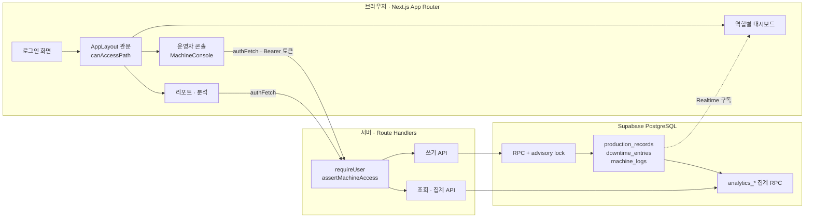
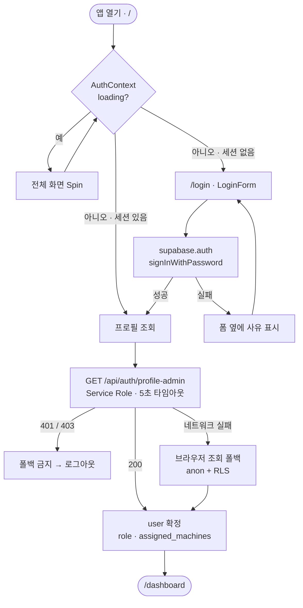
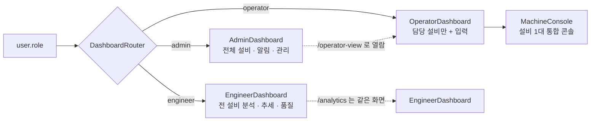
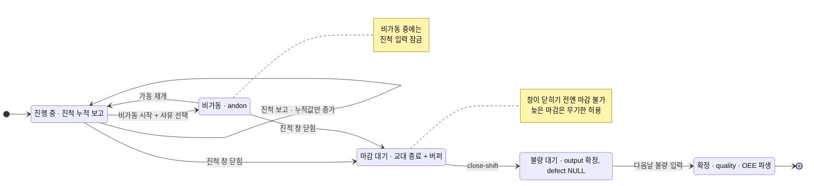
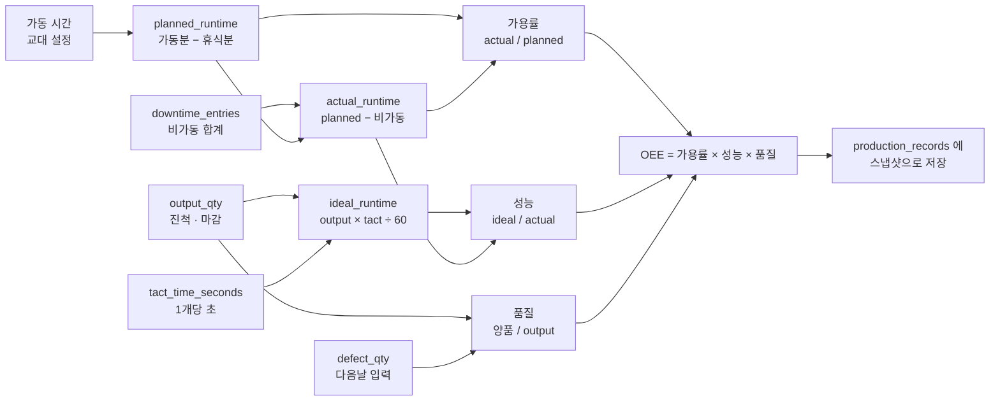
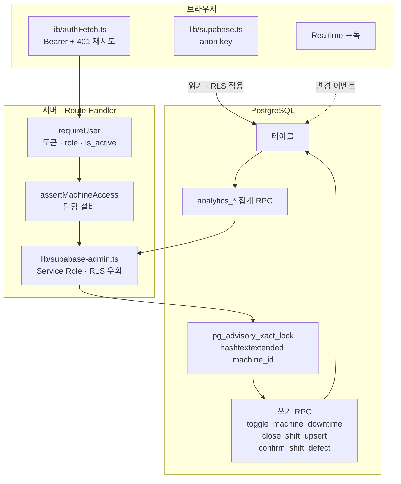

# CNC OEE 앱 전체 워크플로우

- 작성일: 2026-08-04
- 기준 브랜치: `feat/claude-2026-07-31-role-tiers`
- 범위: 진입·인증 → 접근 관문 → 입력 → 결과 산출 → 데이터베이스 연결
- 근거: 저장소 코드 직접 확인 (`src/app`, `src/components`, `src/lib`, `src/hooks`)

> 이 문서는 코드의 한 시점을 옮겨 적은 것이다. 어긋나면 코드가 옳다.
> 같은 내용의 도면 버전: 세션 아티팩트 `CNC OEE — 앱 전체 워크플로우`.

이 앱은 화면 이동이 아니라 **교대(shift)의 수명주기**를 축으로 읽어야 이해가 빠르다.

---

## 목차

| 절 | 내용 |
|---|---|
| [00](#00-한눈에--세-개의-층) | 한눈에 — 세 개의 층 |
| [01](#01-어떻게-시작하는가) | 진입 · 인증 |
| [02](#02-누가-어디까지--단-하나의-관문) | 접근 관문 · 역할 |
| [03](#03-어떻게-입력하는가--교대의-수명주기) | 입력 · 교대 수명주기 |
| [04](#04-그-밖의-입력-경로) | 그 밖의 입력 경로 |
| [05](#05-결과가-어떻게-나오는가) | 결과 산출 |
| [06](#06-데이터베이스와-어떻게-이어지는가) | DB 연결 |
| [07](#07-그림에-그려지지-않는-것) | 함정 |

---

## 00. 한눈에 — 세 개의 층

브라우저는 **anon 키 + RLS**로 읽고, 쓰기는 거의 전부 **서버 API 라우트**를 통과한다.
서버는 Service Role 키로 RLS를 우회하므로, 각 라우트가 `requireUser()`로 토큰·역할·활성 여부를
직접 검사한다. 실제 쓰기는 다시 **Postgres RPC** 안에서 잠금과 함께 원자적으로 일어난다.



---

## 01. 어떻게 시작하는가

루트 `/`는 화면이 아니라 **분기**다 (`src/app/page.tsx`). 세션이 있으면 `/dashboard`,
없으면 `/login`으로 즉시 교체(`router.replace`)한다.

로그인 후 프로필 조회는 Service Role API를 먼저 시도하고, 실패하면 브라우저 조회로 폴백한다 —
**단 401/403은 폴백하지 않는다**. 비활성 계정의 거부를 anon 조회로 우회하면 세션이 되살아나기 때문이다
(`src/contexts/AuthContext.tsx`).



### 세션이 만료되면

모든 인증 요청은 `authFetch`(`src/lib/authFetch.ts`)를 지난다. 401을 만나면
**토큰 갱신을 한 번 시도**하고, 그래도 401이면 앱 전체에 세션 만료를 통지한다.

이 장치가 없을 때는 만료가 각 패널의 도메인 오류("비가동 내역을 불러오지 못했습니다")로
새어 나와, 사용자가 데이터가 깨진 줄 알고 새로고침만 반복했다.
권한 부족은 403으로 구분되므로 **401은 언제나 세션 문제**다.

---

## 02. 누가 어디까지 — 단 하나의 관문

접근 규칙은 `src/lib/pageAccess.ts`의 **표 하나**에만 있다. 사이드바 메뉴와 페이지 가드가
같은 표를 읽으므로 한쪽만 고치는 일이 물리적으로 불가능하다.

관문은 모든 페이지를 감싸는 `AppLayout`이며, 우회할 수 있는 페이지가 존재하지 않는다.
표에 **등록되지 않은 경로는 거부**된다(fail-closed) — 등록을 잊은 새 페이지는 전원에게 열리는 대신
아무에게도 안 열려 즉시 드러난다.

사이드바에는 **모든 역할이 같은 메뉴 목록**을 본다. 권한 없는 항목은 사라지지 않고 자물쇠와 함께
비활성으로 남는다 — 메뉴가 역할마다 달라지면 "내 화면에는 그 메뉴가 없다"는 문의가 곧바로 생기고,
무엇이 존재하는지조차 알 수 없다.

| 경로 | 화면 | admin<br>시스템 관리자 | engineer<br>관리자 | operator<br>사용자 |
|---|---|:---:|:---:|:---:|
| `/dashboard` | 역할별 대시보드 | 허용 | 허용 | 허용 |
| `/machines` | 설비 현황 · 상태 입력 | 허용 | 허용 | 허용 |
| `/production-records` | 생산 기록 관리 | 허용 | 허용 | 허용 |
| `/operator-view` | 운영자 콘솔 | 허용 | 허용 | 허용 |
| `/data-input` | 교대 데이터 입력 폼 | 허용 | 허용 | **차단** |
| `/model-info` | 모델 · 공정 · tact | 허용 | 허용 | **차단** |
| `/reports` | 리포트 생성 · 내보내기 | 허용 | 허용 | **차단** |
| `/analytics` | 분석 대시보드 | 허용 | 허용 | **차단** |
| `/admin` | 설비 · 사용자 관리 | 허용 | *제한* | **차단** |
| `/machines/bulk-upload` | 설비 일괄 등록 (메뉴 없음) | 허용 | 허용 | **차단** |
| `/settings` | 시스템 설정 | 허용 | **차단** | **차단** |

*제한*이 붙은 `/admin`은 라우트 권한만으로 표현되지 않는 층이다.
관리자(engineer)는 사용자를 **만들고 지울 수 있지만 역할을 바꾸지 못하고, admin 계정은
만들지도 지우지도 못한다**. 새 admin 계정을 만들어 그 비밀번호로 로그인하면 역할 변경과
결과가 같기 때문에, 한쪽만 막으면 막은 것이 아니다.

### 역할이 화면을 고른다

`/dashboard`는 `DashboardRouter`가 `user.role`로 셋 중 하나만 렌더링한다. 셋을 모두 정적 import하면
쓰지 않는 두 개까지 초기 번들에 실리므로 `next/dynamic`으로 분리되어 있다.



`/operator-view`가 따로 있는 이유 — `DashboardRouter`는 역할로 화면을 고르므로, 이 URL이 없으면
관리자가 자기 시스템의 운영자 화면을 열어볼 방법이 없다. 반대로 예전에는 이 페이지가 admin 전용이라
**운영자 본인**이 메뉴에서도 URL에서도 자기 콘솔에 못 왔다 (2026-07-31 수정).

---

## 03. 어떻게 입력하는가 — 교대의 수명주기

이 앱의 중심 워크플로우다. 운영자는 설비 한 대를 고르고, **한 화면(콘솔)에서 네 가지만** 한다:
진척 보고 · 비가동(andon) · 지난 교대 마감 · 다음날 불량 입력.
예전에 세 곳으로 흩어져 있던 입력 진입점을 하나로 합친 결과다.

핵심은 **2단계 확정**이다. 교대가 끝나면 생산량만 먼저 확정하고(`defect`는 NULL),
불량은 검사가 끝나는 다음날 입력한다. 그래서 가용률·성능은 마감 시점에 스냅샷으로 굳고,
품질과 OEE만 보류 상태로 남는다.



### 콘솔의 네 가지 동작

컴포넌트는 모두 `src/components/dashboard/operator-console/` 아래에 있다.

#### 1. 진척 보고 — 인라인 입력, 모달 아님

`ProgressInputSection.tsx`

값의 의미는 "이 교대에서 지금까지 만든 **총 개수**"다. 누적이므로 줄어들 수 없고, 줄어든 값이 오면
오타이거나 예기치 못한 상황이라 **409로 되묻는다** — 조용히 받으면 그 차이만큼 생산량이 증발한다.
작업자가 친 숫자를 30초 폴링이 덮지 않도록, 손대지 않은 칸만 최신값을 따라간다.

```
POST /api/production-progress → report_shift_progress (append-only)
  409 machine_in_downtime      비가동 중 입력 잠금
  409 + last_reported_qty      누적값 감소
```

#### 2. 비가동 — andon 한 동작

`DowntimeAndonSection.tsx`

정상이면 "비가동 시작 → 사유 선택", 비가동이면 "가동 재개". 버튼 하나의 호출이
`machine_logs`와 `downtime_entries`를 **함께** 기록한다.
사유는 `machine_status` ENUM의 비정상 값 8개: 점검 · 고장 수리 · PM 보전 · 모델 교체 ·
계획 정지 · 프로그램 교체 · 공구 교체 · 일시 정지.

```
toggle_machine_downtime RPC
  pg_advisory_xact_lock(hashtextextended(machine_id, 0))
```

#### 3. 지난 교대 마감 — 원탭 확정

`CloseShiftSection.tsx`

진척값이 있으면 prefill되어 한 번 눌러 확정, 없으면 종이 카운트를 직접 입력한다.
대기가 여러 건이면 건수 배지와 교대 선택 칩으로 대상을 고른다.
귀속은 **인자의 date/shift**이며 입력 시각과 무관하다 — 늦게 불러도 그 교대의 실적이 된다.

```
POST /api/production-records/close-shift
  output = final_qty ?? 그 교대의 마지막 진척값
  defect = NULL (미검사)
```

#### 4. 다음날 불량 입력 — 확정

`DefectPendingSection.tsx`

가용률·성능 스냅샷은 그대로 두고 **품질과 OEE만 파생 재계산**한다. 검증과 갱신은 재마감과 같은
잠금 키 아래 RPC 안에서 원자적으로 일어난다 — 앱에서 읽고 쓰면 재마감과 경쟁해 확정 불량이 유실된다(TOCTOU).

```
PATCH /api/production-records/[recordId]/defect → confirm_shift_defect RPC
  reason=exceeds_output → 400
  reason=not_found      → 404
```

### 화면과 API는 같은 규칙을 두 번 적용한다

UI가 현재 교대를 마감 목록에서 제외해도, API를 직접 호출하면 진행 중·미래 교대의 확정 레코드를
만들 수 있었다. 그래서 창 검사·담당 설비 검사·감소 검사가 **서버에도 다시** 있다.
`assertMachineAccess`는 `record_id`만으로 남의 설비 실적을 조작하지 못하게 막는다.

---

## 04. 그 밖의 입력 경로

운영자 콘솔 바깥에서 데이터가 들어오는 곳. 대부분 관리자 이상 권한이다.

| 화면 | 무엇을 넣는가 | 도달하는 곳 |
|---|---|---|
| `/data-input` | 교대 생산 데이터 폼 입력 · 수정 | `production_records` |
| `/machines` | 설비 상태 변경 · 비가동 사유 정정 | `machine_logs` · `downtime_entries` |
| `/model-info` | 제품 모델 · 공정 · **`tact_time_seconds`** · cavity | `product_models` · `model_processes` |
| `/admin` 설비 탭 | 설비 마스터 CRUD | `machines` |
| `/admin` 사용자 탭 | 계정 · 역할 · 담당 설비 배정 | `user_profiles` |
| `/machines/bulk-upload` | 엑셀 템플릿으로 설비 일괄 등록 | `machines` |
| `/settings` | 교대 시간 · 휴식 · OEE 임계값 · 알림 | `system_settings` + 감사 이력 |

`/settings`의 교대·휴식 설정은 화면 하나에 갇힌 값이 아니다.
`planned_runtime = max(0, 가동분 − 휴식분)`이므로 이 값을 바꾸면 이후 모든 계산의 분모가 바뀐다
(`src/lib/plannedRuntime.ts`).

---

## 05. 결과가 어떻게 나오는가

### 계산식

내부 값은 모두 `0..1` 범위이며 표시할 때만 퍼센트로 바꾼다.
시간 필드는 **분**, tact time은 **초**다.



> **`tact_time_seconds`는 1개당 시간이다 — cavity로 나누지 않는다.**
>
> JIG에 2 cavity가 있으면 1 사이클에 2개가 나오고, **그 사실은 이미 개당 값에 반영되어 있다**
> (사이클 1,152초 ÷ 2 = 개당 576초). `cavity_count`는 참조용이다.
> 계산에 다시 나누면 성능이 정확히 `1/cavity`로 눌린다 — cavity=2에서 48.8%, cavity=4에서 24.5%.
> 이 계산은 **다섯 개의 쓰기 경로**에 있으므로 항상 함께 고쳐야 한다
> (`CLAUDE.md` 참조, `perPieceTactContract.test.ts`가 전부를 고정한다).

### 보여주는 곳

- **실시간** — `useRealtimeData`가 `machines` · `machine_logs` · `production_records` 세 테이블을 구독한다.
  끊기면 재연결하고, 폴링이 뒤를 받친다.
- **콘솔 지표** — 확정 전에도 진척·경과율로 실시간 가동×성능을 보여준다.
  교대 창이 720분 모델이 아니면 계산을 포기한다(fail-closed).
- **대시보드** — admin은 전체 현황과 알림, engineer는 추세·품질 분석, operator는 담당 설비와 입력.
- **리포트** — `/reports`에서 PDF(jsPDF)와 엑셀(xlsx)로 내보낸다. 차트는 html2canvas로 이미지화해
  PDF에 싣는다. 기본 조회 기간은 가장 긴 템플릿(월간 30일)과 같은 상수를 공유한다.
- **분석 API** — 품질 · 생산성 · 비가동 분석은 각각 `analytics_*` RPC로 **SQL 안에서** 집계한다.

> **집계는 SQL에서, 원시 행은 페이지 단위로.**
>
> PostgREST는 **100,000행**에서 조용히 잘린다 — 200 응답에 경고도 없다.
> `production_records`는 약 325k행이므로 제한 없는 조회는 언제나 틀린다.
> 그래서 통계는 전체 집합에 대해 SQL로 계산하고, 원시 행을 돌려주는 `/api/oee-data`는
> `total` · `has_more`를 함께 노출한다.
> 보이지 않는 상한은 결함이고, 보이는 상한은 그냥 페이지다.

---

## 06. 데이터베이스와 어떻게 이어지는가

연결은 **두 갈래**다. 브라우저는 anon 키로 RLS 아래에서 읽고, 서버 라우트는 Service Role 키로
RLS를 우회한다. 우회한다는 것은 **그 라우트가 스스로 검사하지 않으면 사실상 공개 엔드포인트**라는 뜻이다.
`src/proxy.ts`는 matcher에서 `/api`를 제외하므로 API에는 어떤 인증도 자동 적용되지 않는다.



### 쓰기에는 잠금이 하나만 있어야 한다

`machines` 또는 `downtime_entries`를 쓰는 함수는 반드시 같은 advisory lock을 먼저 잡는다.

```sql
perform pg_advisory_xact_lock(hashtextextended(p_machine_id::text, 0));
```

**키가 같아야 의미가 있다** — advisory lock은 Postgres에서 독립된 네임스페이스라
`SELECT ... FOR UPDATE`와 서로를 차단하지 않는다. 한쪽은 행 잠금만, 다른 쪽은 advisory만 쓰면
넷 다 "잠금이 있는" 것처럼 보이지만 상호 배제는 전혀 없다.

따라오는 규칙:

- **판단과 쓰기는 같은 잠금 아래 있어야 한다.** 비활성 여부 같은 조건을 Node에서 먼저 조회해
  RPC에 넘기면, 그 조회는 트랜잭션 밖이라 조회와 쓰기 사이가 비어 있다.
- **순서는 항상 advisory → 행 잠금.** 모든 경로가 같은 순서라야 데드락이 없다.
- 규약은 `supabase/migrations/__tests__/machineStateLockProtocol.test.ts`가 강제한다.

### 앱이 호출하는 RPC

| 분류 | 함수 |
|---|---|
| 쓰기 · 상태 | `toggle_machine_downtime` · `apply_machine_update` · `upsert_downtime_entry` · `delete_downtime_entry` · `correct_open_downtime_reason` |
| 쓰기 · 실적 | `report_shift_progress` · `confirm_shift_defect` |
| 집계 | `analytics_oee_daily` · `analytics_oee_by_machine` · `analytics_oee_records_summary` · `analytics_productivity` · `analytics_quality` |
| 설정 | `get_system_setting` · `update_system_setting` · `update_system_settings_batch` · `update_my_preferences` |

### 주요 테이블

| 테이블 | 담는 것 |
|---|---|
| `machines` | 설비 마스터 · 현재 상태 |
| `machine_logs` | 상태 변화 시계열 |
| `downtime_entries` | 비가동 — 생산 입력과 **독립적으로** 먼저 기록된다 |
| `production_progress_reports` | 교대 중 진척 보고 (append-only) |
| `production_records` | 확정 실적 + OEE 스냅샷 |
| `production_shift_states` | 교대 일정 상태 — `MISSING`은 `OFF`·`HOLIDAY`와 다르다 |
| `user_profiles` | 역할 · `assigned_machines` · 활성 여부 |
| `model_processes` | `tact_time_seconds`(개당) · `cavity_count`(참조용) |
| `system_settings` | 교대 · 휴식 · OEE 임계값 (+ 감사 이력) |

---

## 07. 그림에 그려지지 않는 것

화살표로는 보이지 않지만, 이 워크플로우를 다룰 때 실제로 사고를 냈던 지점들이다.

### 스냅샷은 과거를 지킨다 — 그리고 과거를 고치지 않는다

`production_records`는 tact · cavity · `ideal_runtime` · 성능 · OEE를 **저장 시점의 값**으로 담는다.
나중에 공정을 바꿔도 지난 교대의 역사가 다시 쓰이지 않는다.
뒤집어 말하면 **계산 로직을 고쳐도 기존 행은 그대로다** — 명시적인 재계산이 따로 필요하다.

### 비가동 입력이 없다는 것은 비가동이 없었다는 뜻

작업자는 비가동이 생겼을 때만 기록하지, 아무 일 없었다고 확인해 주지 않는다.
`resolveConfirmedDowntimeMinutes(measured)` → `measured > 0 ? measured : 0`.

다만 `measured === null`(비가동 **조회 자체가 실패**한 경우)은 여전히 NULL로 둔다 —
"조회했더니 0"과 "조회를 못 했다"는 다른 종류의 모름이고, 후자를 0이라 단정하면 데이터를 지어내는 것이다.

### NULL 지표는 0%가 아니다

NULL은 "계산할 수 없음"이지 "0%"가 아니다. `oee || 0`으로 뭉개면 멀쩡한 설비가 죽은 것처럼 보인다 —
실제로 396개 행이 빨간 0.0%로 렌더링된 적이 있다.
지표 타입은 `number | null`이어야 한다. `number?`는 "모름"을 표현할 수 없어서 바로 그 버그를 가능하게 만든 타입이다.

### B교대는 자정을 넘는다

날짜 범위 · 일 집계 · 타임존을 건드릴 때는 A와 B를 **모두** 확인해야 한다.
A만 맞는 코드는 절반의 시간 동안만 맞는다.

### OEE 정합성 Edge Function은 예약 실행되지 않는다

함수는 배포되어 있고 유효한 관리자 토큰으로 호출하면 동작하지만, `pg_cron`이 설치되어 있지 않아
**스케줄이 없고**, 앱 안에 살아있는 호출자도 없다.

하는 일도 한 가지뿐이다 — `output_qty = 0`이면 파생 지표도 0이라는, 산술적으로 반박 불가능한
명제만 적용한다. 작업자 입력값은 건드리지 않고 행을 새로 만들지도 않는다.

> `docs/OEE_AGGREGATION_SYSTEM.md`는 아직 옛 서술(pg_cron 스케줄)을 담고 있다.
