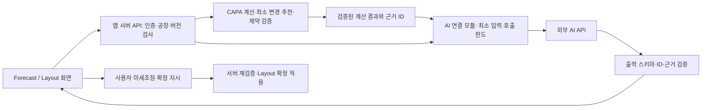

# Forecast 기반 CNC 최소 변경 Layout 시뮬레이션·확정 적용 기능 기획서

- 작성일: 2026-09-22
- 버전: v0.8 — 기존 OEE CAPA 기준 확정, Forecast 접수·검증 구현 착수
- 상태: **사용자 구현 착수 지시 반영. Excel 접수·검증 및 OEE CAPA 공통 기반 구현 중. 상세 진행은 FORECAST_IMPLEMENTATION_STATUS.md 참조.**
- 대상 앱: CNC OEE Monitoring System
- 적용 규모: 1공장 800대 / 2공장 350대. 사용자 요구 규모이며 현재 운영 DB 등록 대수를 실측한 값은 아니다.
- 검토 기준 코드: `main`, `3fa9b19fdbcf38d486b41bb54fd5d5c3ff81ee11`
- 초기 산출물은 개발 기획서였으며, 후속 사용자 지시로 현재 브랜치에서 앱 구현에 착수했다. 운영 DB 적용·배포는 아직 수행하지 않았다.

## 1. 목표와 핵심 판단

공장별 Forecast Excel을 접수하면 해당 공장의 현재 모델·공정별 설비 배치와 T/T를 비교하여 **유지할 모델, 줄일 모델, 내려야 할 설비 번호, 부족한 설비 수**를 근거와 함께 제시한다. 가능한 경우 교체 후 투입할 모델·공정까지 연결한다.

사용자의 추가 결정에 따라 기능의 중심은 **확정 Layout을 기준으로 설비 변경을 최소화하는 시뮬레이션 → 변경 전후 시각 비교 → 사용자 명시적 적용 지시 → 새 확정 Layout 저장**이다. 전 주 확정 Layout을 보관하며, 주중 변경을 포함한 현재 유효 버전을 기준으로 새 안을 만든다. 작은 화면에서도 확대·축소·이동으로 전체와 개별 설비를 확인할 수 있어야 한다.

필요 설비 수는 검증 가능한 수식과 제약조건으로 계산한다. AI는 Excel 모델명과 앱 모델명의 매칭 후보, 데이터 이상 설명, 계산 결과의 자연어 설명을 제공한다. AI가 수량·T/T·설비 번호를 임의로 생성하거나 계산 결과를 덮어쓰지 못하게 한다.

개발 가능성은 높다. 현재 앱에 공장별 인증, 설비별 현재 모델·공정, 공정별 T/T, Excel 처리 기반이 있다. 다만 **설비 호환성, 미래 가동 달력, 교체 소요시간, Forecast 공정 해석**을 보완해야 실제로 실행 가능한 철거 추천이 된다. 파일의 모델 누락이나 빈 수량만으로 철거 대상을 확정할 수 없다.

## 2. 사용자와 확정한 요구사항

| ID | 항목 | 결정 | 상태 |
|---|---|---|---|
| D01 | 적용 규모 | 1공장 800대, 2공장 350대 | 사용자 확정 |
| D02 | Forecast 접수 | 공장별 파일을 각각 접수하고 독립 계산 | 사용자 확정, 2026-09-22 |
| D03 | 결과 | 현재 배치 모델과 Forecast를 비교하여 내려야 할 모델·설비 번호 제시 | 사용자 요청 |
| D04 | AI | 기능에 AI를 접목 | 사용자 요청; 세부 역할은 본 문서 제안 |
| D05 | 기획 산출물 | MD 파일 보관, 분석 중 사용자와 대화 | 사용자 확정 |
| D06 | 공정 해석 | `CNC 1 ~ CNC 2` 수량을 CNC1·CNC2 각각에 동일하게 적용, 공정별 T/T로 독립 계산 | 사용자 확정, 2026-09-22 |
| D07 | 날짜 의미 | 해당 날짜의 CNC 생산 계획량; 고객 납품일 역산은 하지 않음 | 사용자 확정, 2026-09-22 |
| D08 | 계획 기간 | 기준일, 권고 기간, 교체 방지용 선행 확인 기간 | 미확정 |
| D09 | CAPA 기준 | 현재 OEE 앱의 가동시간·휴식·효율 정의와 CAPA 계산법 재사용. 별도 효율계수 추가 없음. 날짜별 휴무/가동 및 재고·재공 정책은 별도 | 기존 OEE 기준 사용자 확정, 2026-09-22 |
| D10 | 설비 선택 기준 | 호환 설비, JIG·공구 제약, 교체시간, 유지 우선순위 | 미확정 |
| D11 | 사용·확정 권한 | 사용자가 지시할 때 시뮬레이션을 Layout에 확정 적용; 역할별 실행 권한은 추가 확정 | 적용 흐름은 사용자 확정 |
| D12 | 최적화 목표 | 생산계획 충족에 필요한 설비 변경을 최소화 | 사용자 확정, 2026-09-22 |
| D13 | 이력 | 전 주 확정 Layout과 이후 변경 버전을 저장 | 사용자 요청 반영 |
| D14 | Layout UI | zoom in/out으로 작은 화면에서도 확인 가능 | 사용자 확정 |
| D15 | 설비정보·셋업 | 확정 즉시 설비 모델·공정을 목표 배치로 반영. 현장은 Layout을 보며 셋업 대기→진행 중→완료를 체크 | 사용자 확정, 2026-09-22 |
| D16 | 공간 정보 | 사용 중인 `Setting CNC.xlsx`의 W39 A/B동 배치를 최초 UI 기준으로 사용 | 사용자 제공, 원본 배치 확인 |
| D17 | CAPA 초과 | 여유 CAPA 상황뿐 아니라 요구량이 CAPA를 초과할 때의 대응 연구·설계 포함 | 사용자 요청, 2026-09-22 |
| D18 | 수동 미세조정 | 시뮬레이션 후 사용자가 변경안을 직접 수정하고 재검증·확정 가능 | 사용자 확정, 2026-09-22 |
| D19 | AI 연동 방식 | AI가 필요한 기능에 API를 연결하는 방식으로 개발 | 사용자 확정, 2026-09-22 |
| D20 | Layout 파일 사용 범위 | 하단 계산표 제외; 상단 A/B동 위치·설비 번호·모델·공정만 참조 | 사용자 확정, 2026-09-22 |

**공장 독립 계약:** 1공장 부족분을 2공장 설비로 자동 보충하지 않는다. `800:350` 비율로 물량을 배분하지 않는다. 선택 공장과 파일 귀속을 확인하고 해당 공장의 모델·T/T·설비·설정만 조회한다.

## 3. 확인용 Excel 실측 결과

### 3.1 원본 정보

- 파일: `C:\Work Drive\APP\CNC OEE 참조파일\ALMUS TECH FORECAST W39 update B7.xlsx`
- 파일 크기: 1,195,062 bytes
- SHA-256: `972402c59cc5aec580d5a6f043966ac68162191e5d8fccf47c9026598e7802b3`
- 시트: `ALMUS TECH` 1개. 사용 범위 메타데이터는 249행 × 85열(A:CG).
- 기간: I:CG, 2026-09-07~2026-11-22, W37~W47, 77일.
- 상단 6~8행은 공정군별 합계. 상세 헤더는 13~14행, 상세 식별 행은 15~229행.
- 상세 215행: `CNC` 72행, `CNC35` 1행, `CL-DB` 72행, `TRI` 70행.
- 숨김 D열 기준 모델명은 72종. `PA1`은 CNC/CNC35에 걸쳐 있어 모델명만으로 행을 합치면 안 된다.
- 숨김 A:D에는 결합 식별자·Vendor·공정 코드·모델명이 있다. F/H의 모델·Vendor 표시에는 병합 셀이 존재한다.
- 명시적인 T/T·설비 번호·공장 구분 필드는 확인되지 않았다. 파일명이나 Vendor만으로 공장을 추정하지 않는다.

### 3.2 수식·오류·결측

| 항목 | 확인 결과 | 개발 영향 |
|---|---|---|
| 수식 | 16,095개 | 값과 수식 정보를 분리하여 보관 |
| 외부 통합문서 링크 | 2개 | 서버에서 외부 파일을 찾아 재계산하지 않음 |
| 오류 | `#N/A` 4,242개, BM:CG에 분포 | W45~W47 값을 0으로 변환 금지 |
| W39 CNC/CNC35 수량 | 오류 셀 0개, 빈 셀 24개 | W39도 무조건 확정 가능하지 않음 |
| 소수 | 전체 기간 CNC/CNC35 수량에 소수 셀 48개 | 단위·반올림 정책 확인 필요 |
| 병합·숨김 | 식별 열과 과거/미래 날짜 일부 | 화면에 보이는 셀만 읽는 파서 금지 |

대표 수식 `W21`은 외부 `[2]Detail All Model`을 참조하는 VLOOKUP이며 저장된 결과는 9,000이다. 저장된 캐시가 원본 외부 파일의 최신 상태인지는 이 파일만으로 검증할 수 없다.

W39 CNC 빈 셀은 `Hubble Y2` 2개, `O1` 7개, `B2 Main mmW` 7개, `PA3 Sub6` 1개, `B2 Sub` 7개다. **빈값·오류·파일에서 모델이 빠진 경우와 명시적 숫자 0은 각각 다른 상태**로 관리한다.

### 3.3 W39 산술 확인용 표

아래는 W39(2026-09-21~09-27) CNC/CNC35 행의 숫자 셀만 합산한 원본 점검값이다. 결측을 0으로 확정한 생산계획도 아니고, 현재 배치나 필요 설비를 계산한 결과도 아니다.

| 원본 모델명 | W39 숫자 셀 합계 |
|---|---:|
| H8 MAIN | 55,500 |
| H8 SUB | 40,200 |
| ON 1 | 24,500 |
| ON 3 | 24,500 |
| M1 | 101,500 |
| M3 | 30,100 |
| B7 Main mmW | 4,600 |
| B7 Sub | 3,500 |
| PA1 | 21,000 |
| B6 Main Sub6 | 21,064.70588235294 |
| 합계 | 326,464.70588235295 |

숫자 셀 합계는 상단 CNC 합계 행의 W39 합계와 일치했다. 이는 산술 정합성 확인이며, 공정 의미·결측 해석·최신성까지 검증한 것은 아니다. `CL-DB`와 `TRI` 수량을 CNC 수요에 합산하면 안 된다.

### 3.4 추가 제공된 현재 Layout

- 파일: `C:\Work Drive\APP\CNC OEE 참조파일\Setting CNC.xlsx`, 시트 `W39`.
- SHA-256: `1ed2777bea687f05ef4079429a260ebf54b56c1ec10d8db44156d9b7e9bfba83`.
- B동 제목 B2, 배치 4~40행: 설비 1~448번, 448대.
- A동 제목 B42, 배치 43~87행: 설비 449~800번, 352대.
- 총 800대, 번호 1~800 누락·중복 없음. 번호 바로 아래 셀의 모델·공정 표기를 읽고 셀 주소·행/열 위치를 함께 보존한다.
- `C0` 표기 21대도 원문대로 보존한다. CNC1/CNC2로 임의 치환하지 않으며 실제 공정 연결 시 확인한다.
- A/B동은 800대 공장 내부의 건물 구분이며, 1공장/2공장 구분으로 해석하지 않는다. 2공장의 실제 배치 자료는 별도로 필요하다.
- **사용자 지시로 89행 이후 하단 계산표와 삽입 이미지를 사용하지 않는다.** 여기에서 T/T·효율·가동시간을 가져오지 않는다.
- 셀 배열을 논리 좌표로 사용한다. 실제 거리/통로 폭/설비 외형 치수는 이 시안에서 추정하지 않는다.
- `src/utils/machineLocation.ts`의 기존 주석에 나타난 A/B동 대수와 이 Excel 표기가 다르므로, 시안은 사용자가 제공한 Excel을 기준으로 한다. 운영 DB의 공장/건물 정보를 자동 변경하지 않는다.

## 4. 현재 앱과의 연결 지점

| 기능·계약 | 확인 근거 | 새 기능에서의 사용 |
|---|---|---|
| 설비의 모델·현재 공정·상태 | `src/types/index.ts:50`, `src/types/index.ts:73` | 비교 기준 배치 스냅샷 |
| 설비 API의 공장 필터·페이지 조회 | `src/app/api/machines/route.ts:106` | 누락 없는 공장 설비 수집 |
| 모델·공정 조회의 공장 범위 | `src/app/api/product-models/route.ts:14`, `src/app/api/model-processes/route.ts:30` | 공장별 모델·T/T 매칭 |
| T/T는 초/개, cavity 재적용 금지 | `README.md:28`, `src/app/api/production-records/oeeRules.ts:2`, `src/utils/oeeCalculator.ts:157` | 동일 단위 계약 유지 |
| 공장 인가 | `src/lib/factoryAuth.ts:202` | 모든 조회·저장·AI·내보내기에 적용 |
| 공장 설정 읽기 | `src/lib/factorySettings.ts:71` | 공장별 교대·시간대 스냅샷 |
| 교대·자정 경계 | `src/utils/shiftUtils.ts:20` | 날짜와 업무일자 해석 |
| Excel 업로드·미리보기 | `src/app/api/admin/machines/bulk-upload/route.ts:35`, `src/lib/excel/machineTemplate.ts:1` | 기존 XLSX 의존성·미리보기 패턴 재사용 |
| ALT/ALV와 동일 번호 체계 | `supabase/migrations/20260824110000_multi_factory_alv_and_memberships.sql:6` | 공장+설비 ID로 식별; 이름만으로 조인 금지 |

현재 검색 범위인 `src/types`, `src/app/api`, `supabase/migrations`에서 Forecast 전용 엔진·재고 원장·교체시간/설비 호환성 관리 기능은 확인하지 못했다. 운영 DB 존재 여부는 별도 검증 대상이다.

설비의 위치는 `machines.location` 문자열로 표현되어 있고(`src/utils/machineLocation.ts:3`), 검색한 앱 코드에서 물리적 설비 좌표·줌 가능한 공장 배치도·주간 Layout 버전 기능은 확인하지 못했다. 이후 사용자가 제공한 Excel로 3.4절의 최초 배치 기준을 확보했다. `src/components/layout/AppLayout.tsx`는 앱 공통 화면 틀이며 공장 배치도가 아니다. 따라서 이번 Layout은 신규 도메인으로 설계한다. 현재 설비 변경 공용 경로는 `src/lib/machineUpdate.ts:86`의 `apply_machine_update` RPC 계약을 사용하므로, 이후 실제 모델 동기화 시 그 잠금·상태 이력 계약을 보존해야 한다.

주의: 저장소 기본 지침의 휴식 60분과 `src/utils/shiftBreaks.ts:28`의 110분 상수가 다르다. 새 계산에서 660분이나 610분을 임의로 고정하지 말고 **사용자가 확인한 공장별 미래 가동 달력**을 사용한다. 현재 운영 설정값과 운영 DB 배치·T/T는 이번에 조회하지 않았다.

## 5. 제안하는 1차 제품 범위

### 포함

1. 공장 선택 → Excel 업로드 → 기간·공정군 선택 → 데이터 검증.
2. 공장별 모델 별칭 매핑과 공정 연결 확인. AI 후보는 사용자 확인 후 저장.
3. 현재 배치 스냅샷과 공정별 필요 CAPA 비교.
4. 확정 Layout 기준의 최소 변경 시뮬레이션과 유지 / 감축 가능 / 교체 후보 / 증설 필요 / 판단 보류 결과.
5. 확대·축소·이동 가능한 배치도에서 설비별 현재/권장 모델·공정, 적용 가능 시점, 근거·제약 표시.
6. 사용자 수동 미세조정, 유지/수정 배치 잠금, 되돌리기/다시 실행, 재검증·재시뮬레이션, Excel 결과 내보내기.
7. 사용자 지시에 따른 Layout 확정 적용, 전 주·주중 버전 이력 및 변경 전후 비교.
8. 계산 근거와 일치하는 한국어·베트남어 AI 설명. AI가 실패해도 표·산식 제공.

### 후속 범위로 제안

- 사용자 지시 없는 Layout 자동 확정·실제 설비 자동 제어.
- ERP/MES 재고·자재·납품 시스템의 자동 연동.
- 공장 간 물량 이전·통합 최적화.
- CL-DB/TRI 설비까지 포함하는 전체 공정 스케줄링.
- 설비 고장 예측, 학습 기반 T/T 자동 변경, 분 단위 전 공장 APS.

사용자 지시에 의한 **Layout 확정 적용과 설비정보 즉시 갱신, 현장 셋업 체크는 1차 범위에 포함**한다. 설비의 모델·공정은 확정 목표를 표시하고, 현장 준비 여부는 별도 셋업 상태로 표시한다. 과거·진행 중 생산 실적은 실제 생산 당시 모델·공정·T/T로 보존한다. 도면의 위치 이동과 설비의 모델/공정 교체도 다른 변경 유형으로 기록한다.

## 6. 계산 계약 제안

### 6.1 입력 단위

계산 키는 `(factory_id, model_id, process_id, business_date)`이다. 같은 모델이라도 공정별 T/T와 설비 수를 따로 계산한다. 사용자 확인에 따라 `CNC 1 ~ CNC 2` 수량 9,000개는 CNC1 수요 9,000개와 CNC2 수요 9,000개로 전개한다. 이를 완제품 수요 18,000개로 합산하지 않는다. CNC1과 CNC2를 동시에 수행하는 동일 설비로 중복 배정하지 않는다. 예외 행 `CNC 3 ~ CNC 5`의 대상 공정 연결은 별도 매핑으로 확정한다.

- 수요: 원본 수량, 단위, 날짜 의미, 선택 기간, 원본 셀 주소.
- 설비: ID·번호·현재 모델·공정·활성 여부·상태·계획 가용시간.
- 공정: 개당 T/T와 그 버전. 0·음수·누락은 계산 불가.
- 제약: 가공 가능 모델/공정, JIG·공구, 교체시간, 유지 잠금.
- 운영 조건: 교대·휴식·휴무·효율과 근거, 필요하면 재고·재공·안전재고.

### 6.2 기준 수식

사용자 결정에 따라 **현재 OEE 앱의 CAPA 계산을 기준으로 한다.** `ShiftDataInputForm`의 공식을 `src/utils/productionCapacity.ts`로 추출하여 기존 입력 화면과 후속 Forecast 계산이 같은 함수를 사용하도록 한다. T/T는 개당 초, 시간은 분이다.

```text
필요 표준가공시간(분) = Q × t / 60
교대 계획가동시간 = max(0, 교대 가동시간 - 교대 휴식시간)
설비별 교대 CAPA = floor(교대 계획가동시간 × 60 / t)
설비별 일 CAPA = Σ 교대별 CAPA  (교대마다 내림 후 합산)
동일조건 설비의 필요대수 = ceil(Q / 설비별 일 CAPA)  (CAPA > 0)
서로 다른 설비의 선정 조건 = Σ 선정설비 CAPA >= Q
```

`cavity_count`를 다시 곱하거나 나누지 않는다. 현재 교대 설정 화면의 효율은 휴식 차감 후 생산 가능 시간의 비율이며 별도의 성능 보정계수가 아니다. 따라서 휴식 차감 후 이 효율을 다시 곱하지 않고, 목표 OEE나 최근 OEE도 추가로 곱하지 않는다. 공장별 `getBusinessTimeConfig(factoryId)`와 `getBreakTimeMinutes(factoryId)`를 재사용한다. 설정 조회 실패는 계산 보류이며 임의 기본값으로 숨기지 않는다. 설정이 존재하지 않을 때의 기본값은 기존 OEE reader 계약을 따른다.

기존 생산입력은 교대 가동시간을 입력값으로 조정할 수 있다. Forecast의 날짜별 교대 가동/휴무·부분일 조건은 별도로 명시해야 하며, 기본 교대 시간만으로 모든 날짜의 실제 가용시간이 확정됐다고 간주하지 않는다. 셋업/계획정지 차감은 후속 시뮬레이션 제약으로 구분하여 근거와 중복 차감 여부를 검증한다.

사용자 확인에 따라 원본 수량은 해당 날짜의 CNC 생산 계획량이다. 일자를 앞당겨 납품일을 역산하지 않고, 원본 일자를 기준으로 CNC1·CNC2 각각의 수요로 사용한다. 이미 생산계획에 반영된 수율·재고를 추가로 보정하여 수량을 바꾸지 않는다. 재고/재공을 별도로 차감하거나 양품 목표로 재해석하는 기능은 별도 운영 계약이 있어야 한다.

소수 수량은 원본 보존 후 승인된 규칙으로 정수화한다. 기본 제안은 모델·공정·일 단위 합산 후 올림이며, 수율 보정 등이 이미 포함된 값인지 확인한 뒤 결정한다.

**가상 산식 예시:** 수요 9,000개, T/T 120초/개, 순가동 1,320분/일, 교대별 순가동이 각각 660분이면 1대 일 CAPA=660개, 필요대수=14대다. 16대가 동일조건으로 배치되어 있다면 수량상 2대 감축 여지가 있다. 1,320분과 120초는 예시이며 실제 공장 값이 아니다. 호환성·진행 작업·미래 수요 확인 전에는 특정 2대를 철거 확정하지 않는다.

### 6.3 기간·공정 제약

- 주간 합계를 평균낸 값만으로 설비를 줄이지 않는다. 일별 부족과 선택 기간의 최대 부하를 검증한다.
- 오늘 이미 지난 시간을 생산능력에 포함하지 않는다. 진행 중 생산을 반영하지 못하면 다음 완전 업무일 기준으로만 추천하거나 참고용으로 제한한다.
- 주간 합산 수요를 사용할 경우 선행생산·보관이 허용되어야 한다. 허용하지 않으면 일별 납기마다 충족해야 한다.
- CNC1과 CNC2가 순차 공정이면 동일 수요를 각각 계산하되, 전공정 완료 전 후공정 생산을 가정하지 않는다. 상세 일정/재공이 없으면 결과는 CAPA 검토안이며 납기 보장 일정이 아니다.
- 다음 주 급증 모델을 이번 주 0이라는 이유로 내리지 않도록 선행 확인 기간을 둔다. 그 기간에 `#N/A`가 있으면 장기 안전성은 판단 보류한다.
- 선택 기간 밖 오류는 별도로 표시한다. 오류가 있는 기간까지 정상 계산했다고 주장하지 않는다.

### 6.4 실제 철거 대상 설비 선정

1. 공장 전체 설비·모델·공정·설정의 일관된 스냅샷을 만든다.
2. 미확인 수요, T/T 누락, 미확인 호환성, 유지 잠금 설비를 확정 추천에서 제외한다.
3. 현재 배치를 유지할 때의 일별 수요 부족을 계산한다.
4. 감축 후보를 한 대씩 제외했을 때 기존 모델의 각 일자 CAPA가 유지되는지 재검증한다.
5. 부족 모델로 교체한다면 해당 설비의 신규 모델 호환성과 교체 후 가용시간을 다시 계산한다.
6. 생산계획·호환성·잠금 제약을 충족하는 안 중 **기준 Layout 대비 변경 설비 수 최소화 → 계획 기간 내 교체 횟수 최소화 → 교체시간 최소화** 순으로 비교한다. 변경 설비 수는 모델 또는 공정이 바뀐 고유 설비 ID 수이며, 한 설비의 모델과 공정이 모두 바뀌어도 1대로 센다. 기간 중 왕복 교체는 별도 횟수로 센다. 동률은 고정된 설비 ID 정렬 등으로 결과를 재현한다.
7. 실행 가능한 안을 찾지 못하면 부족량·막힌 제약을 표시한다. 탐색 실패를 수학적으로 불가능하다는 판정과 구분한다.

총 설비 수 800/350은 용량 경계다. 유지보수·비활성·잠금·호환성 때문에 실제 사용 가능 대수는 더 작을 수 있다. 미등록 설비를 번호 규칙으로 생성하여 추천하지 않는다.

### 6.5 최소 변경의 판정

- 기준은 시뮬레이션의 `base_layout_version_id`이며, 전 주 버전과 현재 유효 버전이 다르면 현재 버전을 우선한다. 전 주 버전은 비교용으로 계속 조회할 수 있다.
- 수요가 줄어 여유 설비가 생겨도 당장 내릴 필요가 없으면 기존 모델을 유지하는 안이 변경 수 0으로 우선될 수 있다. 따라서 **감축 가능 대수**와 **실제로 내리도록 추천한 대수**를 구분한다.
- 감축 자체를 목표로 삼지 않는다. 다른 모델 생산을 위해 필요한 변경만 제안하며, 예비 설비 확보 정책이 있다면 별도 제약으로 입력한다.
- 변경 설비 수, 기간 내 교체 횟수, 교체 손실시간, 부족량을 각각 표시한다. AI 설명 점수로 이 우선순위를 바꾸지 않는다.
- 단순 탐색은 ‘발견한 안 중 변경 수가 가장 적은 후보’다. 전체 해 공간의 최적성을 증명하지 못하면 ‘최소 보장’이라고 표시하지 않는다. 결과에 feasible / optimal / timeout / no-solution-found를 구분한다.
- 작은 전수탐색 사례로 변경 수 최소성을 검증한다. 800대 규모에서 전역 최소 보장이 필수인지와 허용 계산시간은 P0에서 확정하여 알고리즘을 선택한다.

### 6.6 CAPA 초과 시 처리: 진단 → 대안 비교 → 사용자 결정

이 절에서 CAPA 초과는 **해당 일자의 요구 생산량이 해당 모델·공정에 실제 배정 가능한 생산능력보다 큰 상황**이다. 단순한 공장 전체 대수 부족과 특정 공정의 병목을 구분한다. 아래는 조사 근거를 현재 앱 요구에 맞게 구성한 설계 제안이며, 잔업·일정 변경·외주 허용 정책이 사용자에 의해 확정된 것은 아니다.

#### A. 연구 근거와 적용 판단

- Microsoft의 유한 CAPA 작업계획은 이미 예약된 시간을 빼고 가용시간 안에서 작업을 배정하며, 설비 사용시간 중복을 방지한다. 이 앱도 **계산상 시간 초과 배정으로 부족을 숨기지 않는 방식**을 채택하는 것이 적절하다. [Microsoft Job scheduling](https://learn.microsoft.com/en-us/dynamics365/supply-chain/production-control/job-scheduling)
- Oracle는 선행생산·대체 자원 등을 자원 제약 해결 수단으로 설명하며, 해당 제품의 일부 계획은 다른 대안이 없을 때 과부하를 허용한다. 이 앱은 날짜별 생산계획이 기준이므로 선행생산을 자동 적용하지 않고, 시간 초과안은 ‘추가 CAPA 확보 필요’로 표시하는 것이 적절하다. [Oracle resource constraints](https://docs.oracle.com/en/cloud/saas/supply-chain-and-manufacturing/25d/fausp/plan-considering-resource-constraints-in-a-constrained-supply.html)
- 부족·지연·자원 과부하·대체 자원 사용을 구분해서 알리는 예외 관리가 참고된다. 이 앱에서는 변경 Layout 옆에 같은 종류의 미해결 사유를 표시한다. [Oracle planning exceptions](https://docs.oracle.com/en/cloud/saas/supply-chain-and-manufacturing/25d/fausp/exceptions-in-a-constrained-supply-plan.html)
- 최적화 도구는 가능한 해, 최적해, 불가능, 시간제한 등으로 미판정을 구분한다. 이 앱도 ‘아직 해결안을 못 찾음’을 ‘생산 불가능이 증명됨’으로 오인시키지 않아야 한다. [Google CP-SAT status](https://developers.google.com/optimization/cp/cp_solver)

#### B. 먼저 원인을 분리한다

| 구분 | 판단 | 사용자에게 제시할 내용 |
|---|---|---|
| 현재 배치의 부족 | 현재 Layout으로는 부족하지만 호환 유휴/감축 가능 설비가 있음 | 최소 변경 재배치안 |
| 특정 공정·호환군의 병목 | 공장 전체는 여유여도 해당 모델 공정에 사용 가능한 설비가 부족 | 공정·호환군별 부족 대수/시간, 제약 완화 후보 |
| 총 가용능력의 부족 | 허용 설비·달력·제약 내 재배치로도 요구량을 충족하지 못함 | 잔업/추가교대/일정조정 등 승인 필요한 대안 |
| 데이터 미확정 | T/T·가동시간·매핑·Forecast가 불완전 | 계산 보류; CAPA 초과라고 단정하지 않음 |
| 탐색 미완료 | 제한시간 내 충족안을 찾지 못했으며 불가능도 증명 못함 | 발견한 최선안·남은 부족·미판정 상태 |

진단 단위는 공장×일자×모델×공정이며, 같은 호환 설비를 여러 모델의 추가 CAPA에 동시에 더하지 않는다. CNC1의 여유는 CNC2 부족을 자동 상쇄하지 않는다. 공장 전체 평균 부하율이 100% 미만이어도 병목은 존재할 수 있다.

```text
부족수량 = max(0, 당일 계획수량 - 제약을 지킨 배정 생산능력)
추가 필요 표준시간(분) = 부족수량 × 공정 T/T / 60
단일 모델·공정의 부하율 = 필요 표준시간 / 배정 유효 표준시간 × 100
유효 표준시간 = Σ(배정 가능한 순가동시간 × 보정계수)
```

추가 실제 가동시간은 기존 OEE 시간 기준과 설비별 T/T 차이를 반영해 별도로 산출한다. 가용시간 0이면 비율 대신 ‘생산 가능 설비/시간 없음’을 표시한다. 여러 모델을 섞은 부하는 공정별 가공시간을 합산하되 동일 설비의 시간을 중복 합산하지 않는다.

#### C. 비교할 대응 시나리오

| 대안 | 실행 조건 | 비교 지표 | 기본 처리 |
|---|---|---|---|
| A. 동일 공장 유휴 설비 활용 | 가공 호환성·JIG·작업자·가용시간 확인 | 추가 생산량, 변경 대수, 준비시간 | 기존 권한·제약 내 시뮬레이션 |
| B. 여유 모델 설비 재배치 | 기존 모델의 일별·향후 요구량 유지 | 양쪽 모델 부족 변화, 교체 손실, 변경 대수 | 기존 Layout 대비 최소 변경 후보 |
| C. 병목 공정에 잔업/추가 교대/휴일 가동 | 사용자가 허용한 시간, 인력·자재·정비 조건 확보 | 추가 시간/비용, 변경 대수, 해소 수량 | 가정 시나리오; 승인 전 가용 CAPA에 미반영 |
| D. 선행생산·날짜별 수량 재조정 | 생산계획 변경 허용, 자재·재공·보관 가능 | 날짜별 이동량, 재고, 지연 영향 | 원본 Forecast 보존, 별도 변경안으로 확인 |
| E. 검증된 대체 공정/가공 조건 | 공정 기술 승인과 실제 검증된 T/T 존재 | 확보 CAPA, 품질·준비 영향 | AI가 T/T를 줄이거나 가공조건을 발명하지 않음 |
| F. 외주 등 외부 지원 | 별도 공급처 CAPA·리드타임·품질·비용 확인 | 외부 처리량, 미충족량, 비용 | 1차에서는 수동 협의 대안; 발주 자동화 제외 |
| G. 우선순위별 제한 생산 | 위 대안으로도 전량 불가 | 우선 계획 충족량, 잔여 부족, 조정 필요일 | 예외안. 전체 계획 충족으로 표시 금지 |

한 가지 대안을 강제로 순차 적용하지 않는다. 승인된 조건 안에서 A/B, C, A/B+C 등 **서로 다른 대안**을 비교한다. ‘변경 0대+잔업 과다’와 ‘변경 2대+잔업 없음’의 비용/부담이 다르므로 최소 변경만으로 무조건 전자를 택하지 않는다. **정상 가동조건 내 최소 변경안**을 기본으로 하고, 가동조건을 바꾸는 안은 대안으로 사용자에게 제시한다.

공장별 독립 계산 계약을 유지한다. 1공장 부족을 2공장 설비에 자동 배정하지 않는다. 공장 간 지원을 도입한다면 별도 범위·권한·공정 연결 계약이 필요하다.

#### D. 간단한 가상 비교 예시

한 모델의 CNC2 일일 생산계획 3,600개, T/T 120초/개, 현재 10대, 설비당 순가동 600분, 별도 효율 배율 없이 교체 손실 0분이라는 **가상 조건**:

- 현재 CAPA: `10 × 600 × 60 / 120 = 3,000개`, 부하율 120%, 부족 600개.
- 대안 1: 호환 설비 2대 추가 → 총 3,600개, 배치 변경 최대 2대. 기존 다른 모델의 CAPA를 해치지 않아야 한다.
- 대안 2: 10대 각각 순가동 120분 추가 → 총 3,600개, 모델 변경 0대, 추가 설비시간 20시간(10대×2시간). 허용 교대·인력이 있어야 한다.
- 대안 3: 1대 추가하고 11대 각각 약 60분 추가 → 3,630개, 모델 변경 최대 1대, 추가 설비시간 11시간. 교체시간 발생 시 다시 차감한다.
- 위 조건이 불가능하면 600개 부족을 남기고, 우선 생산할 물량과 생산계획 조정을 사용자에게 요청한다. 숫자상 CAPA를 임의로 늘리지 않는다.

예시는 산식을 설명하기 위한 것으로 현재 공장의 시간·T/T·계획을 대변하지 않는다. 실제 대안은 CNC1 공급능력·재공·인력·자재까지 확인해야 완료량을 보장할 수 있다.

#### E. 부족이 해소되지 않을 때의 Layout 확정 정책 제안

상태를 `충족`, `조건부 충족`, `부족 잔존`, `데이터 보류`, `탐색 미판정`으로 나눈다. `조건부 충족`은 잔업 등 승인/확보되지 않은 가정을 포함한 경우다.

- 정상 확정은 검증한 조건에서 계획을 충족한 안에 제공한다.
- 조건부 안은 조건을 확정한 새 입력 버전으로 재계산한 후 정상 확정한다.
- 부족이 남아도 현장에서 일부 생산을 해야 할 수 있다. 따라서 **‘부족을 인지한 예외 Layout 확정’** 경로를 제안한다. 권한 있는 사용자가 부족 모델·공정·일자·수량, 우선순위, 처리 담당자·대응기한·사유를 명시해야 한다.
- 예외 확정은 생산계획을 충족했다는 뜻이 아니다. 원본 요구량·부족량은 보존하고 배치도와 보고서에 미해결 상태를 계속 표시한다.
- 호환성 위반·설비 중복 예약·공장 권한 위반·stale 버전은 예외 확정으로 우회할 수 없다.
- 우선순위와 잔업 허용 범위가 미설정이면 AI가 임의로 어느 모델을 희생시키지 않는다. 사용자 결정 전 대안/부족 진단까지만 제공한다.

예외 확정 허용 여부와 실행 역할은 추가 사용자 결정 항목이다. AI는 병목 원인과 대안 차이를 설명하되 일정·수량·설비 배정은 동일한 계산·제약 검증을 통과해야 한다.

## 7. Excel 접수·데이터 품질 설계

### 처리 절차

```text
업로드 및 공장 귀속 확인
→ 파일 형식/크기/압축 해제 상한 검증
→ 시트·헤더·실제 날짜·병합 영역 판독
→ 원본 셀과 캐시 값 수집
→ 공정군 필터 및 모델 매핑
→ 오류·빈값·중복·소수 검토
→ 사용자가 입력 기준 확정
→ 불변 Forecast 버전 저장
```

- 기존 `xlsx` 의존성을 우선 재사용한다. 설비 등록용 고정 헤더·1,000행 제한 파서를 그대로 가져오지 않는다.
- 13~14행 같은 위치는 이 샘플 어댑터의 근거일 뿐이다. 실제 `Model/Process/Vendor` 헤더와 날짜를 검증하며 양식 변경은 감지해서 중단한다.
- F/H의 병합 셀만 해당 병합 범위 안에서 복원한다. 수량이나 병합되지 않은 모델 필드를 무조건 forward-fill하지 않는다.
- 숨김 열을 무조건 제외하지 않는다. D와 F가 다를 수 있어 원본 둘 다 보존하고 공정별 별칭을 사용한다.
- 합계 행을 상세 수요에 다시 더하지 않는다. 모델·공정·날짜가 중복되면 근거 확인 없이 합산하지 않는다.
- 오류, 캐시 없는 수식, 음수, NaN, 무한대, 허용 범위 밖 날짜를 구분하여 셀 주소와 함께 반환한다.
- 빈값·누락 모델의 해석을 사용자가 확정하기 전에는 해당 모델 설비를 유지하거나 판단 보류한다.
- 원본 파일의 저장된 수식 결과를 읽는다. 외부 링크 접속·수식 재계산·매크로 실행은 하지 않는다. 캐시 최신성 확인 시각/확인자를 기록한다.
- 재접수는 기존 버전 덮어쓰기 대신 새 버전으로 저장하고 차이를 표시한다. 같은 해시라도 다른 공장의 기록과 노출·중복 판단을 공유하지 않는다.
- 결과 Excel의 사용자 입력 문자열은 문자열 셀로 내보내 수식으로 실행되지 않게 한다.

SheetJS 공식 문서는 수식 표현과 계산기를 구분한다. 기존 CE 파서만으로 외부 참조 수식이 최신 값으로 재계산된다고 가정하지 않는다. [SheetJS Formulae](https://docs.sheetjs.com/docs/csf/features/formulae/)

## 8. AI API 연동 설계

사용자 결정에 따라 **외부 AI 서비스의 API를 앱 서버에서 호출하는 방식**으로 구성한다. 자체 모델 학습·모델 서버 구축을 1차 범위에 넣지 않는다. AI 제공자와 모델은 추후 선택하되, 앱의 요청·결과 계약을 유지하면서 공급자를 교체할 수 있도록 서버 측 연결 모듈을 둔다.

| 역할 | 입력 | 출력 | 검증·제한 |
|---|---|---|---|
| 모델명 매칭 보조 | 해당 공장의 미매핑 명칭, 후보 모델·공정 | 후보 ID·이유·보류 사유 | 후보 목록 밖 ID 거부, 사용자 확정 전 적용 금지 |
| 데이터 이상 설명 | 오류 코드·셀 위치·검증 결과 | 수정 안내 | 수량을 추정해서 채우지 않음 |
| 추천 설명 | 계산 완료한 사실 JSON | 유지/철거/부족 사유 | 허용된 수치·설비·근거 ID와 대조 |
| 시나리오 입력 보조, 후속 | 사용자 요청과 허용 설정 목록 | 변경 조건 초안 | 조건 확인 후 계산 엔진으로 재계산 |

정확한 일치·승인된 별칭을 우선하고, 미매핑만 AI에 전달한다. 모델명이 비슷해도 `Main/Sub`, `mmW/Sub6`, `B7/B7R` 등을 임의로 합치지 않는다. AI 신뢰도 표현은 검증된 확률이 아니므로 자동 승인 기준으로 쓰지 않는다.

원본 통합문서 전체를 외부 AI에 전송하지 않는다. 서버가 공장 권한을 확인하고 최소 데이터만 전송한다. 외부 AI 사용·데이터 처리 조건은 공급자 선정 때 확정한다. API 키는 서버 환경에만 둔다.

파일 내용은 데이터로 취급한다. 셀에 포함된 명령문이 도구 호출이나 권한 변경을 유발하지 않게 한다. 구조화 출력은 스키마와 DB ID로 검증하며, 실패·시간 초과 시 계산표와 규칙 기반 설명으로 대체한다.

AI 제공자·모델·비용 상한은 아직 선정하지 않았다. 1차 도입 평가 기준은 매칭 후보의 정확성, 수치 왜곡 0건, 공장 정보 누출 0건, 응답시간·건당 비용이다. AI 자체가 설비 최적화 엔진이라는 설명은 사용하지 않는다.

복잡한 공정 순서·설비 중복 사용 방지 문제는 제약 최적화로 확장할 수 있다. OR-Tools는 후속 비교 후보이며 이번 기획에서 새 의존성으로 확정하지 않는다. [Google Job Shop 공식 문서](https://developers.google.com/optimization/scheduling/job_shop)

### 8.1 호출 구조와 책임



- **앱 계산 엔진:** Excel 숫자 판독, T/T·CAPA 산식, 제약 기반 설비 선정, 부족량, 변경 수, 수동 수정 재검증.
- **AI API:** 이름/문맥 해석, 후보 제시, 근거 설명, 검증된 대안 비교 요약. 생성 결과를 참고 제안으로 취급한다.
- **사용자:** 매핑 확인, 시나리오 조건 선택, 수동 미세조정, Layout 확정 지시.
- **앱 서버:** 공장/역할 인가, 데이터 취합, AI 호출·검증, 감사 기록, 확정 적용. AI에 DB 쓰기나 Layout 적용 도구를 제공하지 않는다.

### 8.2 AI가 필요한 지점과 호출 시점

| 기능 | 호출 시점 | API에 보내는 최소 정보 | 결과와 후속 동작 |
|---|---|---|---|
| 모델·공정 매칭 | 정확 일치/승인 별칭으로 해결되지 않은 행이 있을 때 | 원본 이름, 해당 공장의 후보 ID·이름·공정, 구분해야 할 표기 | 후보 목록·근거·보류; 사용자 확정 후 별칭 저장 |
| 복잡한 입력 오류 안내 | 기본 오류 안내만으로 해결하기 어려워 사용자가 도움을 요청할 때 | 오류 코드, 셀 위치, 필요한 제한된 문맥 | 설명·확인 절차; 원본 수량 자동 수정 없음 |
| 추천·변경 사유 설명 | 계산 또는 수동 수정 검증 완료 후 ‘AI 설명’을 요청할 때 | 선택 설비·모델의 확정 계산 결과, 제약·근거 ID | 유지/변경 이유, 검증된 수치에 연결된 설명 |
| CAPA 초과 대안 비교 | 계산 엔진이 검증한 대안들이 생성된 뒤 | 대안 ID, 부족 해소량·변경 대수·추가 시간·미확정 조건 | 대안별 장단점·확인할 조건; 순위/제약/수치 임의 변경 없음 |
| 자연어 미세조정, 후속 | 사용자가 ‘이 설비 유지’ 등 문장으로 요청할 때 | 명령과 현재 선택 범위, 허용 편집 항목·후보 ID | 구조화된 편집 초안 → 사용자 확인 → 서버 재계산 |

확대/축소, 화면 이동, 목록 조회, 단순 수동 수정과 숫자 재계산마다 AI를 호출하지 않는다. 표준 오류 문구는 i18n으로 제공하고, 이미 확인된 별칭도 AI를 다시 거치지 않는다. 자연어 편집은 후속 기능으로 두며 1차 수동 편집은 일반 UI로 제공한다.

### 8.3 내부 API와 구조화 결과 계약

외부 AI 공급자 API와 브라우저가 사용하는 내부 API를 구분한다. 브라우저는 외부 AI API 키·주소·모델 선택값을 직접 받지 않는다. 내부 요청은 원본 파일 전체나 임의 DB 쿼리가 아니라 `import_id/scenario_id`, 기대 revision, 선택 항목, 언어, 기능 목적을 전달한다. 서버가 권한을 확인하고 해당 버전의 입력을 구성한다.

| 내부 API 제안 | 기능 |
|---|---|
| `POST /api/forecasts/:id/ai/match` | 미매핑 모델·공정 후보 제시 |
| `POST /api/forecasts/:id/ai/explain-errors` | 선택 오류의 상세 안내 |
| `POST /api/planning/scenarios/:id/explain` | 검증된 Layout 추천·수동 수정 결과 설명 |
| `POST /api/planning/scenarios/:id/ai/compare-alternatives` | 검증된 CAPA 대응 대안 비교 |

공통 응답은 `request_id`, `task`, `input_revision`, `status`, `result`, `warnings`를 가진다. `status`는 `succeeded`, `needs_review`, `unavailable`, `stale`을 구분한다. 공급자 원본 오류나 원시 응답은 사용자에게 그대로 보내지 않는다.

- 매칭 결과: `source_line_id`, `candidates[{model_id, process_ids, reason}]`, `abstain_reason`. 후보는 서버가 전달한 같은 공장 후보 집합에 속해야 한다.
- 설명 결과: `summary`, `items[{subject_id, reason_code, evidence_ids, text}]`. `evidence_ids`는 해당 계산 버전의 근거만 참조할 수 있다.
- 대안 비교 결과: `alternative_id`, `advantages`, `limitations`, `required_confirmations`, `evidence_ids`. 존재하지 않는 대안·승인되지 않은 잔업 조건을 생성해 실행하지 않는다.
- 계산 숫자는 서버의 사실 데이터에서 화면에 표시한다. AI 출력에 숫자가 포함되면 사실과 대조하고, 불일치하거나 근거 연결을 검증할 수 없는 설명은 폐기하고 규칙 기반 설명으로 대체한다.
- 구조화 출력 지원 여부와 실제 SDK 사용법은 선정한 공급자의 공식 문서로 구현 전에 확인한다. 출력 형식 기능만으로 의미·정확성 검증이 끝났다고 보지 않는다.

### 8.4 장애·비용·속도 관리

- AI 미설정·장애·사용 한도 초과 시에도 Excel 접수, 수동 매핑, 계산, Layout 편집·검증·확정 기능을 사용할 수 있게 한다. 화면은 AI 설명만 사용할 수 없음을 표시한다.
- 연결 모듈에 요청당 전체 제한시간, 입력 크기/후보 수, 최대 출력량, 동시 호출 수, 공장별 사용 한도를 둔다. 구체적인 한도값은 공급자 선정과 실측 후 설정한다.
- 429/일시적 통신·서버 오류에만 전체 제한시간 안에서 제한된 재시도를 허용한다. 인증·스키마 오류는 반복 호출하지 않는다. 반복 실패 시 잠시 AI 호출을 중단하고 일반 기능을 유지한다.
- 캐시는 `factory_id + task + 입력 해시/revision + 후보목록 버전 + 언어 + prompt/schema/provider/model 버전`으로 분리한다. 캐시 조회에도 현재 사용자 권한을 검사한다.
- 같은 요청을 동시에 누르면 실행 중 요청을 공유한다. 공급자 측 중복 과금 방지까지 보장한다고 주장하지 않으며, 재시도·취소 이후 사용량도 측정한다.
- 수동 수정 중 이전 버전 AI 응답이 늦게 도착하면 폐기하거나 이전 버전 설명으로만 표시한다. 설명을 새 Layout에 연결하지 않는다.
- 사용량·지연·실패율·사용자 후보 채택 여부를 기록한다. 공장별 요청/토큰/예산 한도 초과는 추가 AI 호출을 중지하고 수동 흐름으로 전환한다. 가격은 모델 선정 시 실제 요율로 산정한다.

### 8.5 서버 연결 모듈과 보안

구현 위치 제안은 `src/lib/ai/`의 서버 전용 연결 모듈, 입력 구성, 응답 검증이다. 공급자별 차이는 연결 모듈에만 두고 계산 엔진·Layout 저장 계약은 공급자 SDK에 의존시키지 않는다. 1차에 여러 공급자를 동시에 도입할 필요는 없다.

설정 항목은 공급자, 기능별 모델, 서버 비밀키, 제한시간, 동시성, 사용량 한도, 기능 활성 여부다. 실제 키는 서버 비밀 설정에 저장하고 클라이언트 번들·응답·로그에 포함하지 않는다. `.env.example`에는 구현 시 변수명과 플레이스홀더만 추가한다. 사용자 입력으로 임의 AI 접속 URL을 지정할 수 없게 한다.

원본 파일·전 공장 목록·사용자 개인정보를 일괄 전송하지 않는다. 기능별로 필요한 모델명·공정명·수치만 추리고, 설비 번호 대신 요청 범위 참조 ID를 사용할 수 있게 한다. 공유 데이터에 포함된 명령문은 실행하지 않는다. 로그에는 원문 전체보다 요청 메타데이터·입력 해시·검증 결과를 우선 남기며 보존기간·접근권한을 정한다.

공급자의 데이터 보관·학습 사용·처리 지역 정책과 계약 조건은 선택 시 확인할 항목이다. 아직 특정 공급자의 보안 특성이나 데이터 처리 조건을 확정한 상태는 아니다. 공급자·모델 선정은 남은 기술 결정이며, API 연결 구조는 본 문서로 확정한다.

## 9. 화면·사용 흐름 제안

**확인용 시안:** [Layout UI 열기](previews/forecast-layout/index.html), [시안 설계·사용 범위](previews/forecast-layout/DESIGN.md). 브랜치 `design/forecast-layout-preview`에서 작성한 독립 HTML 시안이며 main에 병합하지 않는다. 원본 800대의 위치·표기를 사용하고, 수동 변경 예시는 CAPA/최적화 결과와 구분한다. 현재 브라우저 초안과 별도 셋업 예시 이력을 저장한다. 운영 확정 적용·DB·AI 연결은 미구현이다. 예시에서는 변경 조정안→셋업 예시 시작→설비 선택→시작/완료를 체험할 수 있다.

1. **기준 Layout:** 공장·주차·현재 유효 버전·전 주 확정 버전을 확인한다. 최초 운영이면 설비 목록과 위치를 정리하여 기준 버전을 먼저 확정한다.
2. **접수:** 현재 공장, 적용 설비 규모, 파일 버전, 수신일, 계획 시작일과 기간을 표시한다.
3. **검증:** 오류/미매핑/빈값/공정 연결을 표로 표시하고 원본 셀로 추적한다.
4. **조건:** 교대·휴무·효율·교체시간·유지 설비를 확인한다. 예시값과 운영값을 구분한다.
5. **시뮬레이션:** 기존 Layout을 유지하면서 생산량이 충족되는지 먼저 계산하고 부족분에 대해서만 변경안을 만든다.
6. **비교:** 현재/시뮬레이션 Layout, 변경 대상만 보기, 모델별 CAPA와 부족량을 함께 확인한다.
7. **미세조정·저장:** 설비별 모델/공정 수정·서로 교환·유지 잠금 → CAPA/변경 수 재검증 → 사용자 수정 버전 저장.
8. **사용자 적용:** 정확한 대상 공장·기간·버전·변경 대수·불충족 항목을 확인하고 ‘이 Layout 확정 적용’을 실행한다.
9. **현장 셋업:** 설비정보에 반영된 목표 모델·공정과 이전 배치를 확인하고 설비별 ‘셋업 시작’→‘셋업 완료’를 체크한다. 대기/진행/완료 필터와 완료 대수로 작업을 추적한다.
10. **이력:** 새 확정 버전, 확정자·시각·사유, 전 주 대비/적용 직전 대비 변경 및 셋업 작업자·시각을 조회하고 내보낸다.

추천표 필드: `공장 / 설비번호 / 현재 모델 / 현재 공정 / 유지·철거·교체·보류 / 권장 모델 / 권장 공정 / 기준일 / 교체시간 / 기존 모델 잔여 CAPA / 부족량 / 근거 / 데이터 확인 상태`.

UI는 ko/vi, 관리자/엔지니어/운영자별 범위, 모바일, loading/error/empty 상태를 포함한다. 표는 검색·필터·페이지로 탐색하고 배치도는 전체 배치와 설비 상세를 줌 단계별로 표시한다. UI 구현 전 별도 브랜치의 시각적 시안으로 흐름을 확인한다.

### 9.1 Zoom·작은 화면 UX

- 상단 도구: 확대/축소, 배율, 전체 맞춤, 선택 설비로 이동, 초기 위치, 변경 대상만 표시.
- PC: 확대 버튼과 포인터 위치 기준 휠 확대, 빈 배경 드래그 이동. 모바일/태블릿: 핀치 줌, 빈 배경 이동, 설비 터치 상세.
- 화면 이동과 설비 위치 편집은 명확히 분리한다. 기본은 조회 모드이며 드래그가 실제 Layout 편집으로 이어지지 않는다.
- 축소하면 건물/구역·모델군·변경 건수 중심, 확대하면 설비 번호·모델·공정·상태를 표시한다. 미니맵으로 현재 시야를 보여준다.
- 색상 외에 아이콘·범례로 유지/교체/철거/잠금/보류를 구분한다. 선택 설비는 하단 시트 또는 측면 패널로 상세를 제공한다.
- 작은 화면은 전후 화면을 억지로 나란히 놓지 않고 ‘현재/시뮬레이션’ 전환과 동일 위치·배율 동기화를 제공한다.
- 설비 검색은 공장+번호로 이동하고 변경 설비 목록과 도면 선택이 서로 연결된다.
- 버튼/키보드 확대·축소 및 표 보기를 제공해 핀치/색상만으로 기능을 사용하게 하지 않는다.
- 좌표는 논리 좌표계로 저장하며 사용자별 화면 배율·이동량과 분리한다. 줌 조작은 배치 좌표·확정 버전을 바꾸지 않는다.
- 360px 폭과 태블릿에서 설비 검색→확대→변경 비교→상세 확인 흐름을 검증한다. 800대 렌더링은 가시 영역 처리와 단계별 라벨로 최적화하며 실제 측정 후 SVG/Canvas 구현을 결정한다.

### 9.2 Layout 버전·전 주 보관

두 정보를 분리해서 저장한다: **공간 배치**(건물·구역·설비 좌표·방향)와 **생산 배치**(설비별 모델·공정·유지 잠금). Forecast 추천은 기본적으로 고정된 설비 위치 위의 생산 배치를 바꾼다. 물리적 설비 이동을 자동 제안할지는 별도 범위 결정이다.

각 확정 버전은 공장, 적용 주차/시작일시, 기준 버전, 원본 Forecast 버전, 설비별 배치 전체 스냅샷, T/T·계산 정책 스냅샷, 변경 목록, 확정자·확정시각·사유를 가진다. 조회 화면의 실시간 마스터 조인 때문에 과거 모델명·T/T가 바뀌지 않도록 당시 값도 보존한다.

- 확정 버전은 불변이다. 주중 변경도 v2/v3처럼 새 버전을 만들고 v1을 덮어쓰지 않는다.
- 전 주에 새 확정이 없었어도 그 주에 유효했던 버전을 연결해 주간 기준을 남긴다. 주차만으로 버전을 하나로 덮어쓰지 않는다.
- 미래 생산계획의 초안 저장은 설비정보를 바꾸지 않는다. 사용자가 ‘확정 적용’을 지시하면 생산계획 시작일과 관계없이 작업 지시용 모델·공정을 즉시 반영하며, 실제 생산 유효시각은 별도 관리한다. 1차에서 예약 자동 적용은 제외한다.
- 첫 도입 시 전 주 실물이 없으면 ‘초기 기준 Layout’으로 등록한다. 이력을 임의로 만들어 전 주 확정본이라고 표시하지 않는다.
- 이전 버전 복원도 기존 기록 삭제가 아닌 새 복원 버전으로 생성하며 현재 조건으로 재검증한다.
- 확정 목표와 마지막 셋업 완료 배치가 다르면 이전→목표 및 미완료 상태를 함께 표시한다. 셋업 완료 전 목표를 실제 준비 완료 배치로 간주하지 않는다.

### 9.3 확정 적용의 원자성

사용자에게 적용 결과가 한 번만, 완전하게 반영되도록 다음 흐름을 구현한다.

1. 적용 요청에 `scenario_id`, `base_layout_version_id`, 기대 revision, 적용일시, idempotency key를 포함한다. 클라이언트가 보낸 임의 설비 변경 배열을 신뢰하지 않고 서버에 저장된 계산 결과를 사용한다.
2. 서버가 현재 공장·사용자 적용 권한, 입력 완전성, 대상 모델/공정, 기준 Layout과 최신 데이터 일치를 재검증한다. 권고 생성 중 새 버전이 적용되었으면 409로 재시뮬레이션을 요구한다.
3. 공장 Layout 기준 행과 대상 설비를 정해진 순서로 잠그고 새 버전·배치 행·감사 로그·현재 확정 버전 연결·설비 목표 모델/공정 갱신·변경 설비의 셋업 대기 작업 생성을 한 DB 트랜잭션으로 저장한다. 일부 설비만 적용된 상태를 성공으로 반환하지 않는다.
4. 연속 클릭/네트워크 재시도는 같은 적용 결과를 반환한다. 시뮬레이션 편집 후에는 새로운 입력 버전으로 다시 계산한다.
5. `machines.production_model_id/current_process_id`를 확정 목표로 즉시 갱신한다. 기존 설비 잠금 프로토콜과 충돌 검사를 사용하며 여러 HTTP 단건 갱신 반복으로 원자성을 흉내 내지 않는다. 기존 실제 생산 배정·T/T 스냅샷을 먼저 보존하는 9.5절 계약을 선행 구현한다.
6. 확정 직후 UI 캐시를 갱신하고 다른 사용자의 열려 있던 시뮬레이션을 stale로 표시한다. 네트워크 오류로 성공 여부가 불명확하면 실행 키로 적용 상태를 조회한다.

D15는 확정되었다. ‘Layout 확정’은 즉시 작업 지시를 배포하는 행위이고 ‘셋업 완료’는 해당 지시대로 현장이 준비됐다는 별도 기록이다. 확정 버튼이 셋업 완료나 정상 가동을 자동 처리하지 않는다.

### 9.4 사용자 수동 미세조정

사용자 요청에 따라 자동 시뮬레이션은 수정 가능한 초안이다. 편집으로 운영 중인 확정 Layout이 즉시 바뀌지 않으며, 검증을 통과한 사용자 수정 버전에 대해 별도 확정 적용을 실행한다.

| 편집 기능 | 동작 | 검증 |
|---|---|---|
| 특정 설비 유지 | 기존 확정 모델/공정을 유지하도록 잠금 | 그 설비를 제외한 상태로 부족량 재계산 |
| 권장 모델/공정 변경 | 선택한 설비의 계획 모델·공정 수정 | 공장·모델/공정 관계·호환성·T/T·작업시간 |
| 두 설비의 배치 교환 | 선택한 두 설비의 계획 모델/공정 교환 | 양쪽 호환성, 교체시간, 수요 충족 재계산 |
| 모델 제거/대기 | 계획 배치만 비움; 설비 마스터 삭제/비활성화와 구분 | 기존 모델의 CAPA 감소 표시 |
| 수정 배치 고정 | 사용자가 조정한 배치를 재시뮬레이션에서도 유지 | 고정 조건 하에 나머지만 최적화 |
| 잠금 해제 | 다시 자동 추천 대상에 포함 | 현재 입력 버전으로 재계산 |
| 선택 기간/적용일 조정 | 편집 대상 시나리오의 기간/일자를 변경 | Forecast·달력 유효성 및 전체 재계산 |

수동 편집은 모델·공정·기간 배정의 수정이다. 물리적 좌표 편집은 별도 모드·권한으로 분리하고, T/T 원본·Forecast 원본·설비 식별자를 미세조정 화면에서 조용히 변경하지 않는다. 가동시간 변경은 시나리오 조건 편집으로 표시하고 변경 이유를 남긴다. 별도 계획 효율 배율은 추가하지 않는다.

**편집 피드백:** 화면에 ‘자동안 대비 변경 N대’, ‘확정 Layout 대비 변경 M대’, ‘교체시간’, ‘부족 모델/공정/수량’, ‘검증 상태’를 고정 표시한다. 수정 직후 임시 계산을 보여주되 서버 검증 완료 전에는 확정 버튼을 활성화하지 않는다. 연속 수정 중 오래된 응답이 최신 결과를 덮지 않도록 revision으로 구분한다.

**CAPA 초과와 연결:** 수동 편집으로 부족이 생기면 어떤 모델/공정/일자에 얼마가 부족해졌는지 즉시 표시한다. 사용자는 추가 수정, 잠금 유지 후 재시뮬레이션, CAPA 대응 대안 비교를 선택할 수 있다. 데이터 오류/호환성 위반은 적용 차단, 검증된 부족 잔존은 6.6절의 예외 확정 정책에 따른다.

**조작:** PC는 설비 선택 패널·다중 선택·선택 설비 간 교환을 기본으로 제공한다. 드래그 편집을 제공하더라도 명시적인 편집 모드에서만 활성화한다. 모바일은 탭→모델/공정 선택 패널과 명시적 교환 대상 선택을 기본으로 하여 화면 이동/핀치와 충돌하지 않게 한다.

**되돌리기·보존:** undo/redo는 편집 중 초안에만 적용하며 확정 이력을 지우지 않는다. 초안 자동 저장, 마지막 저장시각, 미저장 변경 표시, 이탈/연결 끊김 후 복구를 제공한다. ‘자동 시뮬레이션 원안으로 복원’은 사용자 수정 버전을 보관한 채 새 초안을 만든다. 확정 후 되돌리기는 9.2절의 복원 버전 절차를 따른다.

**재시뮬레이션:** 사용자 고정 배치는 hard constraint로 전달한다. AI/엔진이 잠금을 자동 해제하지 않는다. 잠금 때문에 생산계획이 불가능하면 원인과 해제할 때의 대안을 별도로 제시한다. 고정하지 않은 사용자 수정이 다시 바뀔 수 있는 범위는 실행 전에 표시한다.

**이력·동시 편집:** 각 변경의 설비, 이전값/새값, 사용자, 시각, 이유, 기준 revision을 기록한다. 동일 초안을 두 사용자가 수정하면 기대 revision 비교로 덮어쓰기를 방지한다. 충돌은 409로 반환하고 새 버전을 불러와 변경 내용을 비교하게 한다. 1차에는 복잡한 실시간 공동편집 대신 사용자별 초안 분기 방식을 우선 제안한다.

원래 자동안이 최적해였어도 수동 수정본이 자동으로 최적해가 되지는 않는다. 수정본은 ‘사용자 조정안’으로 표시하고, 충족 여부와 고정 조건 내 재최적화 결과를 구분한다.

### 9.5 현장 셋업 진행 관리

**확정 정책:** 확정 즉시 설비정보의 목표 모델·공정을 갱신하여 현장 작업 지시로 사용한다. ‘셋업 진행 중/완료’는 사용자가 Layout에서 직접 체크한다. 서로 모순되는 두 체크박스 대신 현재 단계와 다음 단계 버튼을 표시한다.

| 단계 | 현장 표시·사용자 행동 | 저장·생산 처리 |
|---|---|---|
| 대기 `pending` | 회색 ○ 대기, 이전→목표 배치, ‘셋업 시작’ | 변경 설비에만 작업 생성. 확정만으로 현재 가동 상태를 MODEL_CHANGE로 바꾸지 않음 |
| 진행 `in_progress` | 주황 ◐ 진행 중, 작업자·시작시각, ‘셋업 완료’ | 시작 시 기존 실제 생산 구간 마감 및 허용된 MODEL_CHANGE 상태 전환을 동일 트랜잭션으로 처리 |
| 완료 `completed` | 초록 ✓ 완료, 완료자·완료시각 | 준비 완료 배정과 버전 기록. 정상 가동은 별도 생산 재개 절차로 확인 |
| 변경 없음 | ‘셋업 대상 아님’ | 작업 수/완료율 분모에서 제외. 완료 실적으로 만들지 않음 |

- 완료율은 선택 공장·확정 버전의 변경 대상 기준 `완료 / 취소 제외 대상`이며, 전체/건물별 집계 범위를 명시한다. 예: 전체 800대 중 변경 40대, 대기 15·진행 10·완료 15 → 15/40 완료.
- 화면에서 확정 버전·설비 번호·목표 모델/공정·이전 배치·셋업 상태를 함께 표시한다. 필터는 전체/대기/진행/완료/대상 아님, 색과 문자·아이콘을 함께 사용한다. 모바일에서도 설비 검색→상세→시작/완료를 수행한다.
- 대기에서 완료로 바로 건너뛰거나 완료 체크를 반복해 시간을 덮어쓰지 않는다. 잘못된 완료는 권한 있는 사용자가 사유와 함께 재개하며 이전 이벤트를 남긴다. 진행 중 문제는 차단 사유를 남겨 완료되지 않은 상태로 유지한다.
- 작업 시작/완료는 로그인한 사용자·서버 시각·사유·기대 revision·멱등 키를 기록한다. 저장 실패/오프라인 상태를 완료로 표시하지 않으며 서버 확인 후 확정 표시한다. 재접속은 최신 버전과 비교한 후 재시도한다.
- 다음 Layout에 미완료 작업 설비가 포함되면 자동 덮어쓰기를 차단한다. 이전 작업을 권한자가 취소/대체하고 실제 준비 상태를 확인한 뒤 새 작업을 생성한다. 다른 설비의 작업은 유지한다. 완료 이력과 초안 undo/redo는 서로 영향을 주지 않는다.
- 모델 제거도 작업이다. 목표 모델/공정은 모두 null인 해제 지시로 저장하고 제거 완료를 기록한다. 제거 완료가 생산 준비 완료를 뜻하지 않는다. 공간 좌표만 변경한 경우 모델 셋업 작업을 자동 생성하지 않는다.
- 셋업 소요시간은 시작~완료와 중단 기록으로 측정하고 CAPA 계획의 셋업 차감 시간과 비교한다. 아직 대기/진행 중인 설비를 목표 모델의 즉시 가용 CAPA에 포함하지 않는다. 계획 CAPA는 예상 완료시각 이후, 실행 가능 CAPA는 실제 준비 상태 기준으로 구분한다.

**생산 실적·T/T 보호 — 운영 적용 전 필수 구현:**

설비 화면의 목표 배정과 실제 생산 구간의 배정을 분리한다. 목표 변경 이전부터 생산하던 물량은 기존 실제 배정의 모델·공정·T/T에 연결한다. 셋업 시작 때 기존 구간을 마감하고, 완료 후 생산 재개 때 준비 완료 배정으로 새 구간을 시작한다. 같은 교대 내 모델 교체는 구간별 실적과 ideal runtime을 합산한다. 예를 들어 A 모델 100개를 생산한 뒤 B로 목표만 확정해도 100개는 A 실적으로 남는다. 셋업 중에는 B 생산량을 자동 생성하지 않는다.

2026-09-22 코드 확인: `src/app/api/production-records/close-shift/route.ts`는 `machines_with_production_info.current_tact_time`을 읽어 교대 계산에 전달하고, `src/app/api/production-progress/route.ts`에도 현재 설비 T/T 조회 경로가 있다. 목표 변경이 실적 계산 T/T를 바꾸지 않도록 이 조회들과 `report_shift_progress`, `close_shift_upsert_v3`, 생산/불량 기록·집계 경로를 실제 배정 구간 기준으로 함께 전환해야 한다. 이는 정적 코드 확인에 따른 통합 요구사항이며 운영 데이터 오류를 재현했다는 의미는 아니다.

기존 상태 enum의 `MODEL_CHANGE`를 활용하되 별도 셋업 작업 상태를 설비 상태 enum에 중복 추가하지 않는다. `src/lib/machineUpdate.ts`의 `apply_machine_update` 및 기존 advisory lock 프로토콜과 동일한 설비/교대 경합 범위를 사용한다. 고장·보전 중에는 시작을 차단하고 현장 사유를 표시한다. 진행 도중 고장으로 바뀐 설비를 완료 처리하더라도 고장 상태를 정상 가동으로 덮어쓰지 않는다. 준비 완료와 가동 재개를 분리해 검증한다.

**제안 권한:** 현장 operator는 같은 공장의 배정된 설비에 대해 Layout 지시 조회·셋업 시작/완료를 수행한다. engineer/admin은 허용된 공장 범위에서 진행 현황 및 사유가 있는 재개/취소를 관리한다. 정확한 담당 범위·재개 권한은 D11에서 확정하며, 셋업 체크 권한이 Layout 편집/확정 권한을 자동 부여하지 않는다. API와 RLS 양쪽에서 factory_id·machine_id·task_id·layout_version·권한을 검사한다.

## 10. 데이터·API 설계 제안

### 신규 데이터

| 단위 | 주요 필드·계약 |
|---|---|
| `forecast_imports` | factory_id, hash, 원본 경로, 수신일, 기간, parser_version, 상태, 작성자 |
| `forecast_lines` | import_id, 원본 모델·공정·날짜·수량·셀, 값 상태, 매핑 ID, 정규화 값 |
| `forecast_model_mappings` | factory_id, 공급자/양식, 원본 모델·공정, 내부 모델·공정 연결, 승인자·버전 |
| `planning_scenarios` | factory_id, import_version, 기간, 정책/달력/제약 버전, 입력 스냅샷 해시, 상태 |
| `planning_results` | scenario_id, 설비 ID, 기존/권장 배치, CAPA·부족량·근거, 계산 버전 |
| `planning_constraints` | factory_id, 호환성, 잠금, 미래 가용시간, 교체시간의 명시적 유형·값 |
| `planning_reviews` | scenario_id, 검토자·확정/반려·사유·기준 스냅샷 |
| `layout_versions` | factory_id, parent_version_id, geometry_version, 적용일시·주차, 확정자·시각, Forecast/scenario 연결, 불변 스냅샷 해시 |
| `layout_assignments` | layout_version_id, factory_id, machine_id, 모델·공정·좌표 참조·잠금, 당시 표시값 |
| `factory_layout_heads` | factory_id별 현재 유효 버전·revision; 동시에 하나의 적용 기준 유지 |
| `layout_apply_events` | factory_id, idempotency key, 기준/결과 버전, 요청자·처리 상태·감사 정보 |
| `machine_setup_tasks` | factory_id, machine_id, layout_version_id, 이전/목표 배정 스냅샷, change/remove 유형, 상태, revision, 시작/완료자·시각, 차단 사유; 설비당 활성 작업 하나 |
| `machine_setup_events` | task_id, factory_id, 이전/다음 상태, 서버 시각·사용자·사유·멱등 키; append-only |
| `machine_assignment_segments` | factory_id, machine_id, 실제 생산 모델·공정·T/T 스냅샷, 시작/종료시각, 준비 완료 버전/작업 참조; 구간 중복 금지, 실적/불량/교대 집계 연결 |
| `planning_overrides` | factory_id, scenario_revision, machine_id, 적용 기간, 변경값·잠금 종류, 사용자·사유 |
| `planning_change_events` | factory_id, scenario_id, revision, 편집/undo/redo 내역, 이전값·새값·작성자 |
| `planning_capacity_exceptions` | factory_id, scenario_id, 모델·공정·일자별 부족량, 조건부 가정, 담당자·기한·예외 사유 |
| `ai_requests` | factory_id, task, 입력 revision/hash, provider/model/prompt/schema 버전, 상태·지연·사용량·검증 결과; 비밀키·원문 전체 기록 금지 |

위 이름은 설계안이다. 마이그레이션 시 FK·인덱스·정규화 범위를 상세화한다. 모델/공정 다중 연결은 구분된 관계로 저장하며, 문자열 배열만으로 의미를 숨기지 않는다. 신규 테이블은 공장 범위 RLS와 복합 FK로 교차 공장 참조를 막는다.

### API 초안

| API | 기능 |
|---|---|
| `POST /api/forecasts/preview` | 파싱·품질 검사·매핑 후보, 운영 설비 변경 없음 |
| `POST /api/forecasts` | 검증된 Forecast 버전 확정 저장 |
| `GET /api/forecasts/:id` | 동일 공장 파일·품질·행 조회 |
| `POST /api/forecasts/:id/ai/match` | AI API 기반 미매핑 후보 조회, 자동 확정 없음 |
| `POST /api/forecasts/:id/ai/explain-errors` | 선택한 입력 오류의 AI 안내 |
| `POST /api/planning/scenarios` | 정책과 불변 입력 스냅샷 생성 |
| `POST /api/planning/scenarios/:id/calculate` | 멱등 계산 실행 |
| `PATCH /api/planning/scenarios/:id/draft` | 기대 revision과 함께 사용자 미세조정·잠금 저장 |
| `POST /api/planning/scenarios/:id/validate` | 사용자 수정안의 CAPA·호환성·최신성 서버 재검증 |
| `POST /api/planning/scenarios/:id/alternatives` | 승인된 조건 내 CAPA 부족 대응 시나리오 비교 |
| `GET /api/planning/scenarios/:id` | 상태·결과 조회 |
| `POST /api/planning/scenarios/:id/explain` | 검증된 결과의 AI 설명 |
| `POST /api/planning/scenarios/:id/ai/compare-alternatives` | 계산 완료된 CAPA 대안의 AI 비교 설명 |
| `POST /api/planning/scenarios/:id/review` | 추천안 검토 기록; 실제 배치 변경과 별개 |
| `GET /api/planning/scenarios/:id/export` | 공장 범위 결과 내보내기 |
| `GET /api/layouts/current` | 현재 공장의 유효 Layout과 revision |
| `GET /api/layouts/versions` | 주차/적용일 기준 버전 이력 |
| `GET /api/layouts/versions/:id` | 확정 Layout 스냅샷 |
| `POST /api/layouts/apply` | 사용자 지시한 시뮬레이션의 검증·원자적 확정 적용 |
| `GET /api/layouts/applications/:key` | 중복 요청·통신 실패 후 적용 결과 확인 |
| `GET /api/layouts/versions/:id/setup-tasks` | 권한 범위 현장 작업·상태별 대수 조회 |
| `POST /api/setup-tasks/:id/start` | 기대 revision·멱등 키 검사 후 셋업 시작·기존 생산 구간 마감 |
| `POST /api/setup-tasks/:id/complete` | 진행 상태/목표 버전 검사 후 준비 완료 기록 |
| `POST /api/setup-tasks/:id/reopen` | 권한자 사유 필수 재개, 이미 시작한 생산 구간 영향 검사 |
| `POST /api/setup-tasks/:id/cancel` | 권한자 취소 사유·대체 작업 연결, 실제 배정 보존 |

제안 권한: admin/engineer는 접수·계산·검토, 확정 적용은 공장 admin을 기본으로 하고 engineer 적용 허용은 정책으로 명시한다. 현장 operator의 지시 조회·셋업 시작/완료를 제공하되 배정 설비 범위는 9.5절 제안을 기준으로 확정한다. 최종 정책은 D11에서 확정한다. 모든 API에서 `requireFactoryUser`를 적용하고 ID 접근도 공장과 함께 검사한다. 파일 저장소는 비공개·공장별 경로·권한 검사된 다운로드를 사용한다.

시뮬레이션 상태는 `draft → validating → ready → calculating → calculated → reviewed`이며 `blocked/failed/stale`을 별도로 둔다. 확정 요청은 `applying → applied` 또는 `failed`로 추적하고 성공 시 설비 목표를 즉시 갱신한다. 셋업은 별도로 `pending → in_progress → completed` 및 이력 보존형 취소를 관리한다. 중복 요청은 같은 실행 키로 처리한다. 계산 중 실패한 부분 결과는 완성안으로 노출하지 않는다.

현재 설비/T/T/교대·제약이 바뀌면 이전 안을 stale로 표시한다. 검토 시 스냅샷을 재확인하고 변경됐으면 409로 재계산을 요구한다. AI 설명 캐시도 공장·시나리오·결과 버전을 키로 삼는다.

## 11. 개발 순서와 완료 조건

| 단계 | 작업 | 산출물·통과 기준 |
|---|---|---|
| P0 운영 계약 확정 | 남은 D08~D11, 2공장 Layout, 최초 기준·파일 결측/소수 처리 확정, 대표 정답 사례 수집 | 입력→예상 설비 수→선정 사유를 사람이 설명할 수 있는 사례 |
| P0-L Layout 기반 | 공간/생산 배치 구분, 초기 버전·주간 이력, zoom/pan 시각적 시안 | 공장별 실제 설비 목록과 연결, 360px에서 개별 설비 탐색 가능 |
| P1 데이터 접수 | 샘플 파서, 매핑, 품질 검사, Forecast 버전 | 원본 대조값 일치, 결측·오류 은폐 0건 |
| P2 계산 기반 | 공장 스냅샷·가동 달력·공정별 CAPA | 수식·단위·경계 테스트 통과 |
| P3 설비 추천 | 기준 Layout 대비 최소 변경, 호환성·잠금·교체시간·미래 수요, CAPA 초과 대안 | 제약 위반 0건, 부족/보류·최적성·조건부 상태 명시 |
| P4 AI API·편집 UI | 서버 AI 연결·구조화 출력·한도/장애 처리, 매칭/설명/대안 비교, 전후 배치도·수동 조정·undo/redo·내보내기 | 수정안 서버 재검증, AI 미설정/실패 시 핵심 기능 지속, 잘못된 ID/수치 차단 |
| P5 확정·현장 셋업 | 실제 생산 배정 구간 먼저 구현 → Layout/설비 목표/셋업 대기 원자적 적용 → 현장 시작/완료 | 이전 실적·T/T 보존, 중복·동시 요청/교차 공장 차단, 전 주/주중 이력과 작업자·시각 보존 |
| P6 공장별 파일럿 | 현장 수작업안 비교, 800/350대 부하·권한 검증 | 공장별 담당자 결과 검토 및 수용 |

초기 구현 위치 제안: `src/lib/forecast/`에 파서·정규화, `src/lib/planning/`에 순수 계산·추천·검증, `src/types/forecast.ts`에 계약, 위 API 경로와 `src/components/forecast/`에 UI. Layout은 `src/components/factory-layout/`, `src/lib/factory-layout/`, `src/types/factory-layout.ts`로 앱 공통 layout과 구분한다. 기존 OEE 저장 로직은 예측값으로 변경하지 않는다.

개발 시작 전 실제 설치된 Next.js의 `node_modules/next/dist/docs/`를 확인한다. DB 변경은 신규 migration으로 작성하고 운영 배포 상태를 별도로 검증한다. 상세 일정은 운영 데이터 확보와 범위 확정 후 산정하며, 현재 단계에서 납기나 비용을 확약하지 않는다.

## 12. 인수 테스트와 성능 목표

| 검증 | 합격 조건 |
|---|---|
| 샘플 파일 구조 | 시트·77일·215개 식별 행·공정 분류를 원본과 대조 |
| 샘플 W39 | CNC 숫자 셀 합계 326,464.70588235295를 오차 1e-6 이내 재현; 빈 셀 24개 별도 유지 |
| 오류 기간 | `#N/A`를 수요 0으로 변환하지 않음; 해당 기간 확정 계산 차단 |
| 결측·누락 | 없는 모델·빈 셀만으로 기존 모델 철거 추천 0건 |
| T/T | 0·음수·누락 차단, 초/분 변환 검증, cavity 이중 적용 0건 |
| 공정 전개 | 원본 9,000개는 CNC1·CNC2 각각 9,000개; 공정별 T/T 적용, 완제품 수요 이중 합산 0건 |
| 반올림 | 확정한 일/모델/공정 집계 단계에서 일관된 올림 |
| CAPA 예시 | 9,000개·120초·교대별 순가동 660분×2이면 14대; 13대는 부족 |
| 달력 | A/B·자정·휴무·부분일·공장별 다른 교대를 반영 |
| 일별 납기 | 주간 평균으로 숨겨진 특정일 부족을 탐지 |
| 제약 | 비호환·유지 잠금·중복 배정·교체시간 누락 0건 |
| 변경 최소화 | 기존 배치로 수요 충족 시 변경 0대; 한 설비의 모델+공정 변경은 1대; 여유 대수를 전부 철거하지 않음 |
| 최소성 표시 | 작은 사례 전수탐색 정답과 비교, 휴리스틱/시간제한 결과를 최적 보장으로 표시하지 않음 |
| CAPA 초과 | 현재 배치 부족/호환군 병목/총량 부족/데이터 보류/탐색 미판정을 구분 |
| 초과 대안 | 예시 3,600개에 대해 현재 3,000·+2대 3,600·+1대/60분 3,630 재현; 다른 모델 CAPA 중복 사용 0건 |
| 가정 관리 | 미승인 잔업·선행생산·T/T 변경으로 충족 표시하지 않음 |
| 예외 확정 | 허용 정책 하에서 부족량·담당자·대응기한 보존; 공장/호환성/중복 배정 검증 우회 0건 |
| 공장 격리 | 동일 CNC 번호가 있어도 타 공장 추천·파일·AI 결과·내보내기 노출 0건 |
| 권한·HTTP | 400/401/403/404/409/413/422/500 및 역할별 접근 테스트 |
| 최신성 | 설비/모델/T/T/달력 변경 후 기존 안 확정 차단 |
| Layout 이력 | 전 주 확정값이 주중 수정·마스터 변경 후에도 그대로 재현됨 |
| 적용 경합 | 같은 기준 버전의 동시 적용 2건 중 하나만 성공, 나머지 409 |
| 적용 원자성 | 중간 오류 시 새 버전·설비 배치·활성 버전 연결이 함께 롤백 |
| 적용 멱등성 | 동일 실행 키 재시도는 버전·감사 이벤트·배치 변경을 중복 생성하지 않음 |
| 미래 계획·복원 | 미래 계획 초안 저장은 운영 변경 없음; 확정 적용 시 목표는 즉시 갱신하되 실제 생산 배정 유지; 복원도 새 검증 버전으로 남음 |
| 실제 배치 연동 | 설비 목표 즉시 갱신+대기 작업 원자성, 이전 생산 모델/T/T 유지, 같은 교대 A→B 구간별 집계 |
| 현장 셋업 | 대기→진행→완료, 변경 없음 분모 제외, 제거 작업, 중복/경합/오프라인 실패, 다른 공장·미배정 접근 차단, 고장 상태 보존, 다음 버전 활성 작업 충돌, 초안 undo가 작업 이력을 바꾸지 않음 |
| 재현성 | 같은 입력·정책·알고리즘 버전은 같은 계산·선정 결과 |
| AI | 잘못된 후보 ID·수치·셀 명령문 차단; AI 중단 시 계산 결과 정상 제공 |
| AI API 장애 | 미설정·타임아웃·429·5xx·잘못된 JSON에서도 수동 매핑/계산/편집/확정 유지, 제한 없는 재시도 0건 |
| AI 버전·캐시 | 타 공장·구버전 응답 재사용 0건, 요청 후 수정된 Layout에 오래된 설명 연결 0건 |
| AI 비용·비밀 | 사용 한도 차단·중복 호출 억제 확인, 브라우저/로그/응답의 비밀키 노출 0건 |
| UI | ko/vi, 역할, 모바일, loading/error/empty 확인 |
| Zoom UX | 360px·태블릿에서 확대/축소/이동/검색/전후 전환; 줌으로 좌표·버전 변화 0건 |
| 수동 편집 | 모델/공정 변경·교환·대기 후 CAPA와 두 기준의 변경 수가 일치 |
| 고정 재계산 | 사용자 잠금 유지; 불가능 시 자동 잠금 해제 0건 |
| 편집 복구 | undo/redo·초안 복구 후 동일 배치 재현; 확정 이력 삭제 0건 |
| 편집 경합 | 오래된 검증 응답/다른 사용자 저장이 최신 revision을 덮지 않음 |
| 부하 | 공장별 800대/350대와 확장 1,150대 조회 fixture에서 누락 0건 |

초기 성능 **목표안**: 샘플 규모 파싱+검증 p95 5초 이내, 공장별 800대·77일 기본 CAPA/추천 p95 10초 이내(AI 제외). 파일 상한·동시 사용자·측정 환경은 구현 전 정의한다. 이는 실측값이 아니며, 목표 미달 시 지속 가능한 작업 실행·상태 조회 구조로 분리한다. 시간 제한 도달 시 부분 추천과 검증 상태를 구분한다.

코드 구현 시 targeted Jest → typecheck → lint → 관련 통합/브라우저 테스트 → build를 실행한다. RLS/운영 마이그레이션/배포 검증은 로컬 테스트와 별도 증거로 관리한다.

## 13. 남은 협의와 착수 판정

우선 협의할 항목은 계획 기간, 날짜별 휴무/부분 가동 조건, 철거 설비 선택 제약과 역할별 작업 범위다. 기본 CAPA 공식과 시간·효율 기준은 기존 OEE 앱을 따르는 것으로 확정했다. Layout 확정 즉시 설비정보 반영 및 현장 셋업 체크는 D15로 확정했다. 800대의 A/B동 최초 Layout 자료는 확보했으며 2공장 배치는 별도로 필요하다. CNC1·CNC2 동일 수량 적용과 날짜별 CNC 생산계획량 해석은 확정했으며, CNC0 및 CNC3~5 예외 매핑은 추가 확인한다. 이후 소수/빈값 처리와 사용 권한을 확정한다.

- 지금 가능한 착수: 샘플 파일 검증 fixture, 업로드·원본 미리보기 설계, 공장별 모델 매핑 설계.
- 운영 결정 후 착수: 정답 기준이 필요한 CAPA/철거 알고리즘 구현.
- 실제 설비 번호 검증 전제: 각 공장의 현재 설비·모델·공정·T/T와 호환/잠금 데이터 확보.
- Layout 적용 개발 전제: 최초 공간 좌표/구역·설비 연결, 확정/셋업 권한 확정, 실제 생산 배정 구간과 T/T 스냅샷 보호 선행 구현.
- 본 문서는 자체 분석 초안이며 별도 검토자의 승인이나 현장 검증을 받은 상태가 아니다.

## 14. 검토 기록

| 일자 | 내용 |
|---|---|
| 2026-09-22 | 원본 Excel 읽기 전용 분석, 캐시/수식 분리 확인, W39 합계 교차 확인 |
| 2026-09-22 | Python openpyxl 3.1.5와 앱의 SheetJS 0.20.3으로 별도 판독: CNC 73행, W39 숫자 합계·빈값 24개, 오류 4,242개, 수식 16,095개 일치(PASS) |
| 2026-09-22 | 현재 main 코드의 T/T·공장 인가·설비 조회·Excel 재사용 지점 확인 |
| 2026-09-22 | 사용자 결정: 공장별 Forecast 독립 접수·계산 |
| 2026-09-22 | 사용자 결정: CNC1·CNC2 각각 동일 수량 적용, 공정별 T/T로 필요대수 계산 |
| 2026-09-22 | 사용자 결정: 날짜별 수량은 해당 날짜 CNC 생산 계획량 |
| 2026-09-22 | 사용자 결정: Layout 기준 최소 설비 변경 시뮬레이션, 사용자 지시에 의한 확정 적용, 전 주 Layout 이력, zoom in/out |
| 2026-09-22 | 사용자 요청: CAPA 초과 대응 연구. Microsoft/Oracle/Google 공식 자료 확인 후 제약 기반 대안 비교·부족 예외 관리 추가 |
| 2026-09-22 | 사용자 결정: 시뮬레이션 후 수동 미세조정. 잠금·재검증·undo/redo·초안 이력 설계 추가 |
| 2026-09-22 | 사용자 결정: 필요한 AI 기능에 API 연결. 서버 연결 모듈·기능별 계약·호출 시점·검증·비용/장애 처리 추가 |
| 2026-09-22 | v0.5 저장. CAPA 가동시간·효율, Layout 확정 후 실제 모델 반영 시점, AI 공급자/모델 등은 협의 중 |
| 2026-09-22 | 사용자 제공 Setting CNC.xlsx의 A/B동 배치로 800대 원본 위치·모델 추출. 하단 계산표 제외 지시 반영 |
| 2026-09-22 | v0.6: 별도 브랜치에 확대/축소·이동·검색·수동 조정·잠금·undo/redo·ko/vi 인터랙티브 시안 추가 |
| 2026-09-22 | UI 시안 브라우저 13개 검증 PASS: 800대 원본 대조·조작·복구·언어·360/390px 모바일·JS/외부 요청 확인 |

| 2026-09-22 | v0.7: 사용자 결정에 따라 설비 목표 즉시 반영·셋업 대기/진행/완료·실제 생산 배정 보존 계약 추가. 브라우저 전용 셋업 시안 8개 검증 PASS; 기존 13개 포함 총 21개 |

v0.7까지는 원본 Excel과 앱 코드를 변경하지 않고 별도 HTML 시안만 추가했다. v0.8에서 사용자 지시에 따라 앱 코드 구현을 시작했으며, 검증 범위와 결과는 [구현 진행 기록](FORECAST_IMPLEMENTATION_STATUS.md)에 별도로 보관한다. 원본 파일의 모델 배치는 확인했지만 운영 DB 등록대수·현재 배치·T/T 값·실제 철거 대상 번호는 아직 검증하지 않았으므로 운영 확정 수치로 제시하지 않는다.

2026-09-22 v0.8: 사용자 구현 착수 지시 및 기존 OEE 시간·효율·CAPA 기준 재사용 결정. Forecast 접수 API/화면, 원본 파서, CAPA 공통 함수와 테스트 추가.
